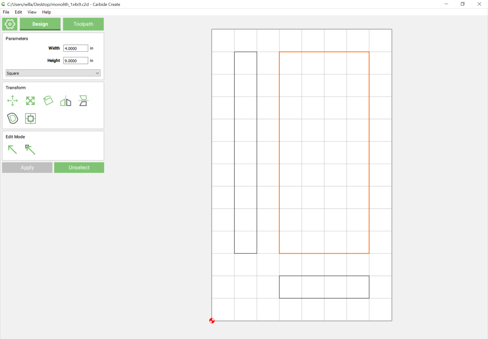
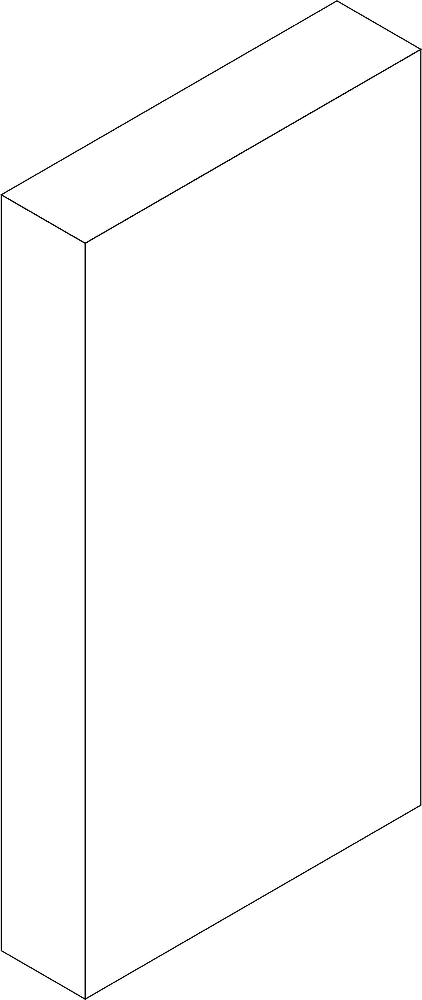
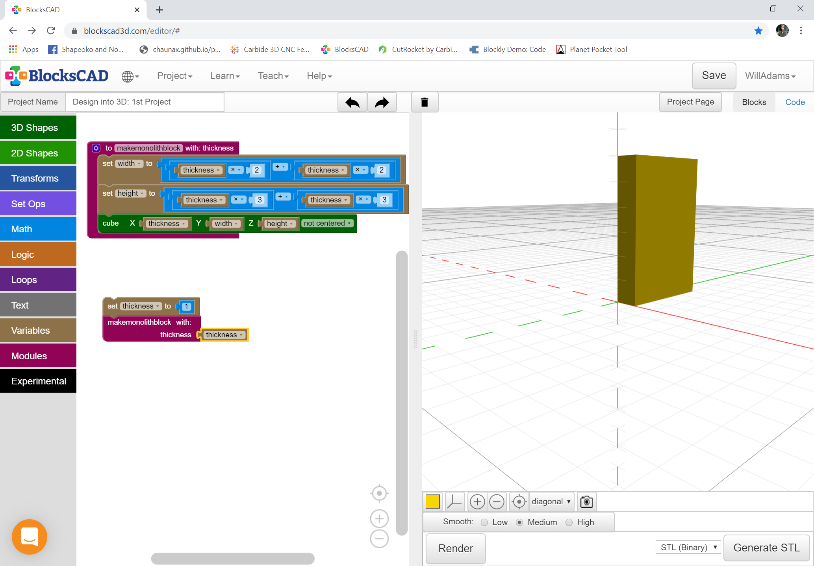
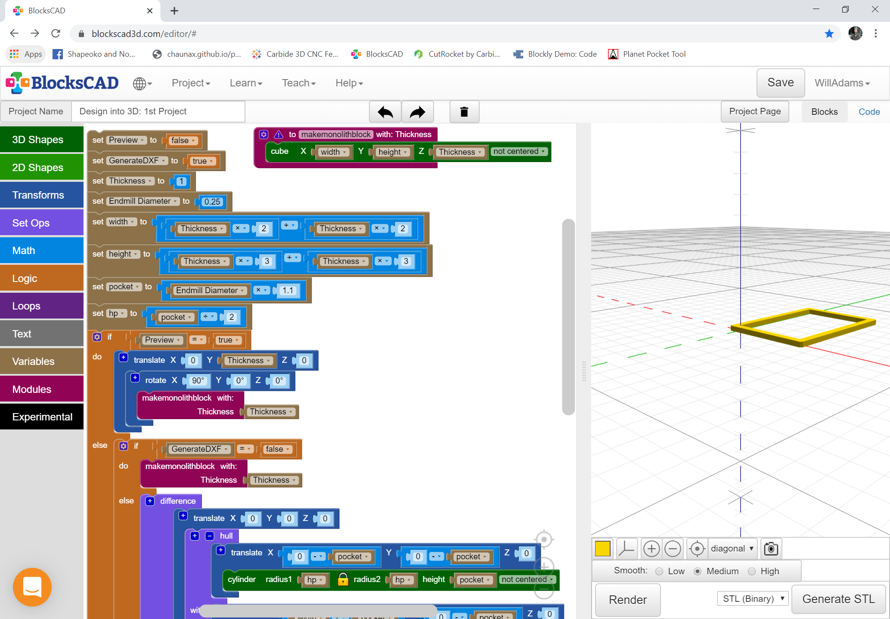

# 1st Concepts

## 1st Project

The first project is a rectangular block with the proportions of the monolith from Arthur C. Clarke's science fiction classic, _2001: A Space Odyssey_, 1:4:9, where the second and third values are the second and third natural squares \(the book goes on to imply that the progression continues in other dimensions, but that is beyond the scope of this project\). This allows us to cover cutting to length and width and to consider part orientation as a necessary adjunct of thickness.

This is of course easily drawn up in profile, and front, and overhead views:

Which may be combined into an isometric view quite easily:

A quick and easy way to model in 3D is to use the Blockly variant of OpenSCAD, BlockSCAD: [https://www.blockscad3d.com/editor/](https://www.blockscad3d.com/editor/)

In it, one simply drags blocks and arranges them and updates variable values until one arrives at a desired design. While one could simply use a cube object and manually enter the values:

`cube(size = [4,1,9], center = false);`

The best practice would be to use a module and have the calculations done automatically based on the user inputting the thickness desired:

With the part designed, the next consideration is manufacture. The easiest way to get a project from BlockSCAD \(or OpenSCAD\) into a CAM tool such as Carbide Create is to export a DXF. If this were done along the standard 2D view, one would get a rectangle as wide as the cube, but only as deep as the thickness, where instead what is wanted is the height, so the block needs to be rotated to provide a different view. As the above 2D drawing makes obvious the correct view for manufacture would be the front.

In order to do this, one would create a checkbox \(or Boolean\) in BlockSCAD \(or OpenSCAD\). Unfortunately, support for 2D in the former is quite limited, so it will be necessary to model this in 3D, and then export to the latter to actually export a DXF.

A further consideration is the matter of tooling ― it is necessary to consider the diameter of the endmill in cutting out the part, so we add a few more variables including `Endmill Diameter` and some logic to arrange things. This also requires that one revisit matters of orientation and rotation. It is best to work with the normal Cartesian orientation ― this allows one to use a cylinder to represent an endmill. Similarly, we want to represent the area which the endmill will remove. Adjust for that and we get:

This is available at: [https://www.blockscad3d.com/community/projects/810179](https://www.blockscad3d.com/community/projects/810179)

In theory one would simply assign an outer profile toolpath to the front view above, but actually manufacturing this is a bit problematic however, since a typical endmill such as a \#201 only has ¾″ of flute length, slotting is hard, and wood is measured in rough cut, not finished dimensions. For the former see: [https://docs.carbide3d.com/tutorials/tutorial-tooling/](https://docs.carbide3d.com/tutorials/tutorial-tooling/) and for the latter, consult a text on woodworking or a book such as R. Bruce Hoadley’s wonderful _Understanding Wood: A Craftsman's Guide to Wood Technology_. 

The solution of course, is making a hollow part with top and bottom and four sides. While modern adhesives would allow a simple butt joint to work, having a CNC affords the option of doing joinery in new ways suited to how the machine can move precisely despite repetition. This book is about that solution.

