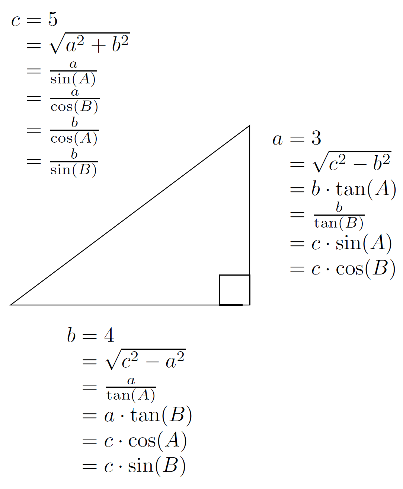
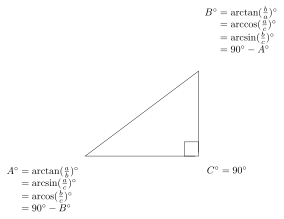
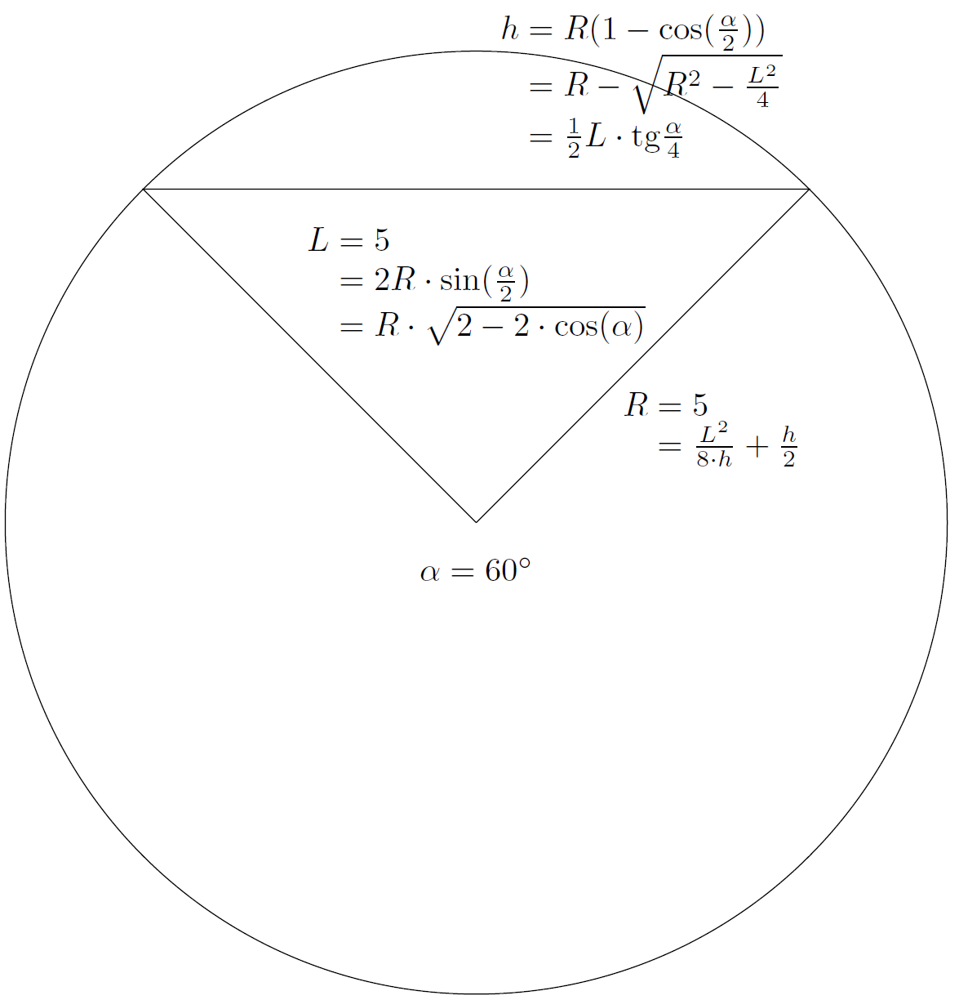

# 2D Drawing

As noted previously, before one can make a part, one must define the geometry of the design. This is done using classic geometric constructs, and possibly curves defined mathematically (but usually drawn up in a CAD or Bézier curve drawing program). We will use Carbide Create as a specific example (freely available from: [https://carbide3d.com/carbidecreate/](https://carbide3d.com/carbidecreate/) — note that some features may only be available in the current beta: [https://carbide3d.com/carbidecreate/beta](https://carbide3d.com/carbidecreate/beta)), but the concepts would apply to any CAD or vector drawing program and will be explored first.

.png>)

As with most drawing tools, there are menus for commands or different program functions/states, a palette of tools, and a work area. Later versions add a pair of rulers around the drawing area and a status bar, (not depicted above).

## Points

The most basic geometric construct as noted by Euclid in [_Elements_](https://mathcs.clarku.edu/\~djoyce/java/elements/elements.html)_:_ [_Book I_](https://mathcs.clarku.edu/\~djoyce/java/elements/bookI/bookI.html)_:_ [_Definition 1_](https://mathcs.clarku.edu/\~djoyce/java/elements/bookI/defI1.html) is a point in coordinate space (most CAD tools and vector drawing applications use Cartesian coordinates, see: [https://gamemath.com/book/cartesianspace.html](https://gamemath.com/book/cartesianspace.html)) ― some CAM tools allow one to assign a drilling operation at a point, but many vector editors disallow a point as an individual stand-alone entity, instead, they are used as a building block for everything else. Carbide Create does not allow the creation of single points, so one would create a circle to define the perimeter of a hole which one wished to machine, or the center of which would define the point at which one wished to drill (see below).

Points of course will be used to define the Cartesian X, Y coordinates of all geometry in the design. Toolpaths will then allow specifying Z, extending this into the third dimension. Note that in some circumstances the term “Node” will be used for a point.

## Lines

Straight lines are a fundamental building block of vector drawing and are of course defined as the shortest distance between two points (Euclid’s _Elements: Book I:_ [_Definitions 2–5_](https://mathcs.clarku.edu/\~djoyce/java/elements/bookI/bookI.html#defs)). Some CAM tools (including Carbide Create) will allow one to assign various toolpaths to lines, and if not directly on the line, the offset will be determined by which point is the origin and which is the final point (which is to say, the path direction) and whether the offset is to the left- or right-hand of the path direction. Carbide Create allows one to draw lines as unclosed paths, by choosing either the Polyline (or Curve) tool:

.png>)

clicking at the beginning (as well as if desired intermediary) and end points:

.png>)

and then clicking on **Done** (without returning to the first point if one wishes an open path). Note that open lines on the default layer in Carbide Create will be indicated by being magenta when not selected, as opposed to the black of closed paths. The current selection is drawn in orange (for objects on the current layer), and if there are more than one element/group selected, the most recently added will be considered the Key Object which will be indicated by being drawn with a dashed highlight.

Open polylines (or curves, see below) have limited functionality in Carbide Create, since they may only be used with Contour toolpaths. Usually one will work with closed paths, since they define regions which one may then assign suitable toolpaths to. There are commands for editing polylines when they are selected in addition to the normal transforms (see below) ― since the edits possible are a subset of those for the Curve tool, and the editing interface makes it possible to convert a polyline into a curve, this is discussed in the **Curve** tool section below.

Lines will be used to define Rectangles (which may be squares) and regular Polygons as described below.

## Arcs

Many CAD programs will allow the definition of arcs which are easily drawn and may be specified in several ways — an origin point, end point, and a point of rotation are typical. Carbide Create does not have an arc tool, but they may be made using Boolean operations as parts of circles and geometry based on circles (segments and so forth), as fillets when rounding the corners of a rectangle (see below), or drawn using the **Curve** tool (see below), though since they are represented as either curves or polylines will necessarily be approximations of an actual arc of a circle.

## Polylines

Polylines are made up of multiple points describing lines and may either be open or closed as noted above. Note that there are multiple ways to represent a given figure, and the capabilities and interface options will be different based on how it was created (so long as it has not been edited). For example, a square may have corner options if drawn using the **Rectangle** tool and may be changed to a rectangle by altering one dimension parameter or other, but if drawn with the regular **Polygon** tool, may be changed into another polygon or resized proportionally, and if drawn using the **Polyline** or **Curve** tool may only be resized proportionally (or asymmetrically by dragging) or node-edited (which are possible with the other creation options).

### Open Paths

As noted above, toolpaths may be assigned to open paths, and the directionality will determine any offset if needed for a toolpath. Open paths are necessarily limited in the toolpaths which may be assigned, and it will typically not be possible to assign any but the most basic of operations to them. In Carbide Create, open paths may be converted to closed by using the Join Vectors command (see Curve Editing below) and it is also possible to combine two (or more) open paths drawn in Carbide Create into a single path, open or closed.&#x20;

Note that in build 527 Carbide Create gained a feature for adding all open paths to the current selection: [https://blog.carbide3d.com/2021/carbide-create-527/](https://blog.carbide3d.com/2021/carbide-create-527/)&#x20;

Edit | Select... | Select Open Vectors

 (1) (1) (1).png>)

### Closed Paths&#x20;

Closed paths meet back at the point of origin and open up additional operations in Carbide Create and most other CAM tools. In Euclid’s _Elements: Book I:_ [_Definition 13–14_ ](https://mathcs.clarku.edu/\~djoyce/java/elements/bookI/defI13.html)they are described as a defined boundary comprising a figure. They may be made up of lines, arcs, curves, or some combination. Often tools will have especial support for regular polygons, allowing their creation or definition quickly and efficiently. Carbide Create has specific support for **Circles**, **Rectangles** (which may be squares), and Regular **Polygons**.

#### Circles

Circles are defined in Euclid’s _Elements: Book I:_ [_Definition 15–17_](https://mathcs.clarku.edu/\~djoyce/java/elements/bookI/defI15.html) __ as a plane figure with one line equidistant from a point, _c.f._, [_Book III_](https://mathcs.clarku.edu/\~djoyce/java/elements/bookIII/bookIII.html). In Carbide Create one draws circles from the inside out, clicking first at the center point, then on a point at the perimeter to define the radius (and by extension, diameter):

.png>)

Note that the **Done** button allows one to cancel out of the circle drawing mode.

In Carbide Create, circles are defined as four Bézier curves (as opposed to using arcs) which is necessarily an approximation of a perfect circle, but one with an error so small as to not matter for practical purposes. Researching the math involved in this differentiation is left as an exercise for the interested reader.

Note that in build 527 Carbide Create gained a feature for adding circles which are within a certain size range to the current selection: [https://blog.carbide3d.com/2021/carbide-create-527/](https://blog.carbide3d.com/2021/carbide-create-527/)&#x20;

Edit | Select... | Select Circles

.png>)

One may select the minimum and maximum diameter for adding circles to the current selection which will include circles drawn with the native circle tool, circles drawn as Bézier curves, and polylines which approximate a circle.&#x20;

#### Rectangles and Squares

Named as quadrilaterals in Euclid’s _Elements: Book I:_ [_Definition 19_](https://mathcs.clarku.edu/\~djoyce/java/elements/bookI/defI19.html), rectangles have a specific tool for their creation; squares may be defined by making height and width equal, and in Carbide Create rectangles have a corner feature which other shapes do not. As circles are, they are drawn from the inside out in Carbide Create by default, or one may hold the ctrl key to draw from corner-to-corner:

.png>)

Since Carbide Create draws from center out by default, shapes are often twice the desired dimensions, in such instances they may be easily scaled to half their size (this applies to other shapes and is often useful/expedient) so as to have them at the desired size, or use the new ctrl-click corner-to-corner option.

### Polygons

Drawing programs often have support for regular polygons, as does Carbide Create. As with other objects in Carbide Create, Polygons are drawn from the center point out:

.png>)

Once drawn, they may be adjusted in their dimensions, and for their number of sides, see below.

### Parameters

Once shapes have been drawn, they may be selected and changed or modified. The most basic change is simply modifying their dimensions, but other properties and features may be available.

#### A Note on Dimensions

In Carbide Create, either inches or millimeters may be selected as the unit for measurement under Job Setup.

In v7, it becomes possible to enter dimensions as calculations, so typing 2\*2= will result in the dimension being set to 4 using the current units.

It is also possible to enter dimensions in terms of the unit, so if in metric mode, typing 1in= will result in the dimension being set to 25.4mm, while in Imperial (inches) mode, typing 25.4mm= will result in the dimension being set to 1in.

It is also possible to reference the current stock thickness. This may be done using an expression which is evaluated using the = key, so typing t= will result in the dimension being set to the current thickness, or typing t will leave the dimension set thus, and will dynamically update the dimension when stock thickness is changed. Expressions may also be used thus, so half the thickness may be referenced using t/2.&#x20;

#### Circle Parameters

For a circle, the size parameter adjustment may be done in terms of its overall size using the **Resize** tool (either **Width** or **Height**, only one may be adjusted, the other will be forced to match), or **Radius**:

.png>)

#### Rectangle Parameters

Rectangles may also be modified in their dimensions, but one is not limited to a regular square, **Width** and/or **Height** may be specified separately:

.png>)

Note that in addition to the dimensions, one may change the shaping/appearance of corners. The possible options are:

* _Square_ (the default shown above)
* _Fillet_ (rounded corners which allow applying an arc to a given corner)
* _Chamfer_ (45 degree angles)
* _Flipped fillet_ (quarter circles removed from corners)
* _Dogbone_ (placing a circle up against the corner so as to ensure that after cutting with a round endmill a part with a right angle corner will still fit)
* _Tee_ (placing a semicircle at a corner to ensure that a part with right angle corners will still fit ― note that orientation may not be specified, but by adding the feature, then rotating the part, this may be controlled)

Once a corner treatment is specified, one may set its dimension in terms of the radius/diameter/distance from the corner:

.png>)

#### Polygon Parameters

Polygons may be adjusted for Radius (since only regular polygons are supported, only one measurement need be specified) and number of sides:

.png>)

## Text

Not geometry, but many drawing and CAD programs allow setting text. Carbide Create affords this:

.png>)

 (1).png>)

Text objects are limited to a single line of text in Carbide Create, and one may select the font from among those outline (OpenType or TrueType format) installed on the computer Carbide Create is running on, selecting Bold and or Italic (which will be applied if the appropriate font variation is installed on the system), setting the Font Height, modifying the Spacing and setting the Alignment.&#x20;

It is also possible to convert text to curves using the button, "Convert to Curves" --- once converted to curves, the underlying geometry may be used. See: [https://carbide3d.com/blog/merging-script-fonts-in-carbide-create/](https://carbide3d.com/blog/merging-script-fonts-in-carbide-create/)

Another option is to set the text on an arc, rather than all in a straight line. When doing so, alignment may be used to control where on the arc the text will appear:

.png>)

which has one checkbox to enable it, and another to move the text to the bottom:

.png>)

and two controls, one which allows setting the center for the arc, the other for where the text is aligned against. Using the shift key when dragging will move both controls in unison.

## Measurements

Some CAD and drawing programs include a measurement tool. Carbide Create adds one in v7:

.png>)

Click on the two points which one wishes to measure to/from:

.png>)

and the coordinates of the two points, the distance between them, and the angle between them will be displayed.

As an alternative to this, a line may be drawn, and when selected will afford the size and the X- and Y-axes.

## Transformations

Geometry may be adjusted in a number of ways:

* Moved to a different location in the drawing area
* Resized or scaled to a different size/proportion
* Rotated
* Flipped along an axis (Carbide Create affords tools for horizontal and vertical)
* Aligned, either to another piece of geometry or the defined Stock

Another option which drawing programs may afford is offsetting ― this is especially important for Carbide Create since it allows one to adjust the geometry in terms of the radius or diameter of the endmill (see below).

### Move

When selecting geometry in Carbide Create and selecting **Move**, the X and Y coordinates may be entered, and the reference point selected from the proxy point (indicated by the highlighted/selected circle), and will move the object so the referred corner is at that point when the Apply button is pressed (the dialog may be cancelled by selecting Done):

### Resize

In addition to moving, geometry may also be altered in size. Selections may be scaled symmetrically using the hollow square drag handles at the corners or by using the numeric interface ― midpoints of the selection marquee afford asymmetric scaling by dragging instead (this is a simple way to create an ellipse/oval) but it is not possible to scale asymmetrically numerically (though such drag-scaling should snap to the grid):

.png>)

### Rotate

Objects may be rotated. This is often useful for decorative designs, and may be required to control part orientation when cutting or doing mechanical design, or to adjust for orientation of T-bones. Note that for some objects it may be better to alter their size rather than rotating them by 90 or −90 degrees in certain programs if the rotation operation should change the objects into Curve objects, removing the ability to interact with their formal parameters.

At this time in Carbide Create, Circle objects will not alter their orientation when rotated, only positioning. If using the nodes for positional information is required, it will be necessary to convert them to Curve objects.

### Flip

Objects may be flipped (mirrored) horizontally or vertically. Useful for decorative designs, it also allows (for instance) the creation of reversed geometry for creating stamps or printing blocks or branding irons or creating a mirror of a part for cutting it as an inlay, or cutting a part from the bottom orientation.

### Align

Most, if not all CAD and design tools allow an option for aligning one or more objects. Typically if only one object is selected, the alignment is against the drawing area, in the case of Carbide Create, against the Stock. Alignment affords precision, and control, especially when one is using Rotation.

In Carbide Create, if multiple objects are selected and stock is not used to align against, the alignment will be against the key object (indicated by being drawn with a dashed highlight).

### Offset Path

Geometry may be selected and offset, either to the inside or outside:

.png>)

When offsetting paths to the outside in Carbide Create, corners are rounded off to match the distance specified as a radius. This allows one to instantiate as geometry the path which would be assigned to an endmill when cutting out a shape. If sharp corners are desired, either draw the design at the largest possible size and inset only, or export to an SVG, do the offsetting operation in a third party tool such as Inkscape, and then reimport, or, redraw the geometry.

### Boolean Operations

Booleans allow for the modification of geometry using existing geometry. Named for the British Mathematician George Boole: [https://www.britannica.com/biography/George-Boole](https://www.britannica.com/biography/George-Boole), they result in new figures based on a logical interaction of two or more figures, so the interface for them only appears when two or more objects are selected (the green indicates the geometry which will be produced by the operation, the black what is used and which is normally replaced by the result):

.png>)

Depending on the selection, Carbide Create affords the following Boolean operations:

* **Union** ― the current selection (two or more objects) will be added together, creating a new object which is the outermost perimeter of the selection
* **Intersection** ― only available when two objects are selected, the new object will be that area included within both objects
* **Subtraction** ― the key object (indicated by a dashed highlight) will be removed from each of the other object(s) in the selection

Note that in most programs, the selection is modified, so if the original geometry will be needed after, it may be necessary that the objects be duplicated in alignment with the originals.

If a given operation does not have the desired result, undoing it in Carbide Create will change which object is the current key object (indicated by a dashed highlight) ― reattempting the operation will then do so based on that new aspect of the selection with different results than previously if applicable to the operation.

## Curves&#x20;

Curves are available in most vector drawing programs, and when present may be defined in several ways.&#x20;

### Bézier Curves&#x20;

The most common is Bézier curves ([https://en.wikipedia.org/wiki/B%C3%A9zier\_curve](https://en.wikipedia.org/wiki/B%C3%A9zier\_curve)), named for the automotive designer Pierre Bézier, which are defined by an on-curve point (the origin), a matching off-curve point, and an additional off-curve point paired with the ultimate (ending) on-curve point. Carbide Create uses Bézier curves in its Curve tool. Note that points are termed as Nodes in the various Curve tool options.

To create a curve, select the Curve tool, then click or click-drag where one wants on-curve points (clicking creates sharp nodes, click-dragging creates smooth nodes, with the click placing the on-curve node, and the drag-release determining the position of the off-curve nodes ― either smooth or sharp nodes may be changed to the other, see below):

.png>)

#### Open or Closed Paths

Once a Curve (or Polyline) is created it may be either open (indicated by being magenta when not selected), or closed (black). Open paths may be closed using the **Join Vectors** command:

.png>)

Note that the beginning and ending nodes will be connected as directly as possible:

.png>)

and it may be necessary to adjust the curve if the path crosses itself.

As of Carbide Create build 627 it is possible to change a closed path to an open path by right-clicking and using the Cut Vector command while in Node Edit mode (see below). Note that often, rather than an open path, one wants a closed path which describes the region which would cut with an open path --- it is possible to use Boolean operations to create a closed geometry which describes where one wishes to cut: [https://community.carbide3d.com/t/deleting-line-help/32956](https://community.carbide3d.com/t/deleting-line-help/32956)&#x20;

#### Principles for Bézier Curves

Bézier Curves should be drawn following some basic principles unless a design dictates otherwise:

* on-curve nodes should be at extrema (north/south (top/bottom), or east/west (left/right)) and at points of inflection (where a shape changes direction, such as at the middle of an _S_ curve)
* curves are smoothest when off-curve nodes follow the “Rule of 30” and are approximately one-third (\~30 percent) of the distance towards the next on-curve node

#### Node Edit Mode

The underlying points of geometry may be modified by selecting it and choosing **Node Edit** Mode:

.png>)

As noted above, geometry is made up of lines and/or curves which are bounded by on-path nodes, and for curves, have a pair of off-path nodes which determine how the curve is drawn.

When in Node Edit Mode it is possible to:

* add an on-path node by right-clicking on a part of the path which does not have nodes and choosing _Insert Node_
* delete an on-path node (when it is selected) by right-clicking and choosing _Delete Node_ — keyboard shortcut _d_ for the currently selected node(s)
* toggle one or more nodes from smooth (indicated by a circle) to sharp (indicated by a square) and vice-versa by selecting and then right-clicking and choosing _Toggle Smooth_ or using the keyboard shortcut _s_ for the currently selected node(s)
* cut open a path (which will convert a closed path to an open one) by right-clicking and choosing _Cut Vector_

Off-path nodes (indicated by small filled circles) may be dragged to reshape the sections of curves associated with smooth nodes, and by holding the Alt (Option) key, dragged without affecting the other off-path node for the associated on-path node creating a sharp node and asymmetry.

#### Corner Tool

Version 633 of Carbide Create adds a Corner Tool:

 (1) (1) (1) (1).png>)

which allows one to modify corners to have a specified radius:

 (1) (1) (1).png>)

only angles which will admit a portion of a circle of the specified radius will be eligible:

 (1) (1) (1).png>)

#### Trim Vectors

A frequent feature in CAD programs is the ability to trim overlapping vectors which was added in version 636:

 (1) (1) (1).png>)

which allows one to remove segments as defined by overlapping:

 (1) (1).png>)

 (1) (1).png>)

Once trimmed, the geometry will necessarily become one or more open paths:

 (1).png>)

It is frequently helpful to use this feature to create sections of geometry from multiple elements which may then be connected using the _Join Vectors_ command as discussed below.

#### Geometric Interactions

With Boolean Operations and the Trim Vector a number of possible interactions are possible. Given a set of curves, for example a rectangle with a circle superimposed:

.png>)

Boolean Union results in:

 (1).png>)

Boolean Intersection:

.png>)

and there are two possibilities for Boolean Subtraction depending on the key object:

Circle:

.png>)

Rectangle:

 (1) (1).png>)

while the Trim Vectors command allows one to trim the various vectors which overlap:

 (1).png>)

 (1).png>)

allowing one to make asymmetrical designs which are not possible with Boolean operations:

.png>)

A further consideration is that the Trim Vectors command results in Curve objects which may be joined and which will not result in polylines:

 (1) (1) (1) (1).png>)

#### Drawing Tutorials

A very basic drawing task is to draw an oval. Originally this tutorial was available at: [http://community.carbide3d.com/t/lets-draw-an-ellipse-with-new-users/4194](http://community.carbide3d.com/t/lets-draw-an-ellipse-with-new-users/4194) — and is provided here in an updated form.

Start by launching Carbide Create — in Job Setup (gear icon) set the width of the drawing area to 20″, the height to 15″, and go into Job Setup | Document background | Edit Ensure the grid spacing is 0.50″. Download the following file:

Placing it on the background layer scaled so that it fills the entire drawing area (scaling to 0.557 should work) and lines up with the grid. Ensure that Snap to Grid is enabled.

Select the **Curve** tool and click on each of the four points of the placed image, clicking again on the first to close the path.

Download and place the image below on the background scaled as before:

Select the path and go into **Node Edit** Mode and right-click on each node and select "Toggle Smooth" (or press the _s_ key) and drag the off-curve nodes to match the positioning of the background image.

The following additional drawing tutorials are available:

* [https://community.carbide3d.com/t/lets-make-a-b-for-anyone/14223](https://community.carbide3d.com/t/lets-make-a-b-for-anyone/14223) — drawing more complex forms with the Curve tool
* [https://community.carbide3d.com/t/how-to-draw-a-compass-rose/16170](https://community.carbide3d.com/t/how-to-draw-a-compass-rose/16170https:/community.carbide3d.com/t/how-to-draw-a-star-carbide-create/16022) — using rotation
* [https://community.carbide3d.com/t/how-to-draw-a-star-carbide-create/16022](https://community.carbide3d.com/t/how-to-draw-a-compass-rose/16170https:/community.carbide3d.com/t/how-to-draw-a-star-carbide-create/16022)
* [https://community.carbide3d.com/t/six-ways-to-round-a-corner/53827](https://community.carbide3d.com/t/six-ways-to-round-a-corner/53827)

and if one has difficulty drawing up anything, either post on the Carbide 3D community forums: [https://community.carbide3d.com/](https://community.carbide3d.com/) or e-mail in to [support@carbide3d.com](mailto:support@carbide3d.com) and we will do our best to assist.

There is also the game:



### Quadratic B-Splines

A curve which alternates on-curve and off-curve nodes, B-Splines are used for TrueType fonts, since their calculation is efficiently done, but are not used in typical CAD or Bézier curve drawing applications because of the difficulty in editing them. Note that when TrueType fonts are converted to paths, conversion from B-Splines to Bézier curves may result in odd node placement.

## Other Features

CAD and drawing programs may have a number of other features, depending on their intended use. Some of these include:

### Layers

Carbide Create supports layers since version 521. Available under Edit | Show Layers:

 (1) (1) (1) (1).png>)

(or using the keyboard shortcut _l_)

it then affords the ability to create and name layers, as well as to color-code them:

 (1) (1) (1) (1) (1) (1) (1).png>)

and to move objects to specific layers and to hide/show, or lock/unlock layers. A Layer is an organizational tool which allows one to separate geometry and colour-code it.​ ​ ​How they are used, depends on a given project and how a user wishes to approach it:

* a two-sided job might have separate layers for each side ​
* a file with multiple parts might have each part on a separate layer
* a file with multiple tools might have the geometry for each tool on a separate layer, and use the Toolpaths facility to associate a toolpath w/ a layer ​

### Arrays

A useful feature in many drawing or CAD programs is the ability to create arrays of objects. Carbide Create affords two options for this:&#x20;

* Linear ― allows rectangular arrangements
* Circular ― allows polar arrangements

To create an array, select one or more objects, invoke the desired command, and then specify the parameters for the array.

#### Linear Arrays

 (1) (1) (1) (1) (1).png>)

 (1) (1) (1) (1).png>)

#### Circular Arrays

 (1) (1) (1).png>)

 (1) (1) (1) (1).png>)

Circular Arrays afford a number of options, and are well-suited to creating geometry which requires symmetry. For example, a five-pointed star may be easily drawn by rotating a triangle to have 5 copies:

 (1) (1) (1).png>)

and then drawing multiple overlapping polylines using the tips of the rotated triangles which defines the star shape:

 (1) (1) (1).png>)

and Boolean unioning them:

 (1) (1).png>)

### File Notes

Carbide Create 7 adds the feature of adding notes to a file:

.png>)

Such notes may have the option of always showing when the file is opened as a reminder:

.png>)

### Tabs

Carbide Create 7 moves Tabs to the Design pane:

.png>)

which may then be instantiated in the Toolpath pane.

## Geometry

When drawing and modeling it is often necessary to place parts relative to the original positioning based on a distance and possibly rotation determined by the dimensions of the parts. Geometry and trigonometry allow the calculation of such positioning, usually in terms of right triangles, or chords for elements based on circles or segments of circles.&#x20;

There are of course several different sorts of triangles depending on the specifics of their angles and the length of their sides.&#x20;

By length:

* scalene ― all sides are different lengths
* isosceles ― two sides are the same length
* equilateral ― all three sides are the same length

By angles:

* right triangle ― one angle is 90 degrees (may also be an isosceles or scalene triangle)
* oblique ― no angle is equal to 90 degrees
* obtuse ― one angle is greater than 90 degrees
* acute ― all angles are less than 90 degrees

Depending on the angles and the orientation of a given triangle, various labeling may be appropriate.&#x20;

For specific triangles, different formulae apply.&#x20;

We begin of course with the Pythagorean theorem:

$$
a^2 + b^2 = c^2
$$

which allows us to determine the length of one side of a right triangle, given the lengths of the other two sides.

$$
c = \sqrt{a^2 + b^2}
$$

$$
b = \sqrt{c^2 - a^2}
$$

$$
a = \sqrt{c^2 - b^2}
$$

All the possible formulae for calculating the lengths of the sides of a right triangle are:

Similarly, the angles of a right triangle may be calculated by:

Projects involving circles are usually calculated in terms of chords, radius, and the height of the chord segment.

Websites for this sort of thing:

* [https://www.mathportal.org/calculators/plane-geometry-calculators/right-triangle-calculator.php](https://www.mathportal.org/calculators/plane-geometry-calculators/right-triangle-calculator.php)
* [https://www.wermac.org/others/convert\_right\_triangle\_calculation.html](https://www.wermac.org/others/convert\_right\_triangle\_calculation.html)
* [http://ambrnet.com/TrigoCalc/Circle3D.htm](http://ambrnet.com/TrigoCalc/Circle3D.htm)
* [https://mathopenref.com/arcradius.html](https://mathopenref.com/arcradius.html)

## Resources

For further information on Carbide Create please see:

* [http://docs.carbide3d.com/assembly/carbidecreate/userguide/](http://docs.carbide3d.com/assembly/carbidecreate/userguide/) (a web page)
* [https://carbide-downloads.website-us-east-1.linodeobjects.com/doc/UserManual\_Carbide\_20210718.pdf](https://carbide-downloads.website-us-east-1.linodeobjects.com/doc/UserManual\_Carbide\_20210718.pdf) (the official manual for v5)
* [http://carbide3d.com/carbidecreate/video/](http://carbide3d.com/carbidecreate/video/) (a collection of tutorial videos)
* [http://community.carbide3d.com/c/software/carbide-create](http://community.carbide3d.com/c/software/carbide-create) (a community forum)
* [https://old.reddit.com/r/shapeoko/wiki/carbidecreate](https://old.reddit.com/r/shapeoko/wiki/carbidecreate) (a wiki page)

* [https://carbide3d.com/carbidecreate/shortcuts](https://carbide3d.com/carbidecreate/shortcuts)
* [https://community.carbide3d.com/t/keyboard-cheat-sheet-for-carbide-create-and-motion/7839](https://community.carbide3d.com/t/keyboard-cheat-sheet-for-carbide-create-and-motion/7839)
* [https://carbide3d.com/blog/carbide-create-v7/](https://carbide3d.com/blog/carbide-create-v7/)
* [https://carbide3d.com/blog/carbide-create-v6-done/](https://carbide3d.com/blog/carbide-create-v6-done/)
* [https://carbide3d.com/blog/carbide-create-v6-is-almost-ready/](https://carbide3d.com/blog/carbide-create-v6-is-almost-ready/)
* [https://carbide3d.com/blog/merging-script-fonts-in-carbide-create/](https://carbide3d.com/blog/merging-script-fonts-in-carbide-create/)
* [https://carbide3d.com/blog/carbide-create-v6/](https://carbide3d.com/blog/carbide-create-v6/)
* [https://carbide3d.com/blog/carbide-create-527/](https://carbide3d.com/blog/carbide-create-527/)
* [https://carbide3d.com/blog/layers-in-carbide-create/](https://carbide3d.com/blog/layers-in-carbide-create/)
* [https://carbide3d.com/blog/carbide-create-413-released/](https://carbide3d.com/blog/carbide-create-413-released/)
* [https://carbide3d.com/blog/carbide-create-400/](https://carbide3d.com/blog/carbide-create-400/)
* [https://carbide3d.com/blog/carbide-create-316/](https://carbide3d.com/blog/carbide-create-316/)
* [https://carbide3d.com/blog/carbide-create-315/](https://carbide3d.com/blog/carbide-create-315/)
* [https://carbide3d.com/blog/carbide-create-311/](https://carbide3d.com/blog/carbide-create-311/)
* [https://carbide3d.com/blog/carbide-create-310/](https://carbide3d.com/blog/carbide-create-310/)
* [https://carbide3d.com/blog/carbide-create-308/](https://carbide3d.com/blog/carbide-create-308/)
* [https://carbide3d.com/blog/carbide-create-307/](https://carbide3d.com/blog/carbide-create-307/)
* [https://carbide3d.com/blog/carbide-create-306/](https://carbide3d.com/blog/carbide-create-306/)
* [https://carbide3d.com/blog/carbide-create-305/](https://carbide3d.com/blog/carbide-create-305/)
* [https://carbide3d.com/blog/carbide-create-304/](https://carbide3d.com/blog/carbide-create-304/)
* [https://carbide3d.com/blog/carbide-create-303/](https://carbide3d.com/blog/carbide-create-303/)
* [https://carbide3d.com/blog/carbide-create-302/](https://carbide3d.com/blog/carbide-create-302/)
* [https://carbide3d.com/blog/carbide-create-301/](https://carbide3d.com/blog/carbide-create-301/)
* [https://carbide3d.com/blog/carbide-create-290/](https://carbide3d.com/blog/carbide-create-290/)
* [https://carbide3d.com/blog/carbide-create-build-289/](https://carbide3d.com/blog/carbide-create-build-289/)
* [https://carbide3d.com/blog/carbide-create-289/](https://carbide3d.com/blog/carbide-create-289/)
* [https://carbide3d.com/blog/big-carbide-create-update/](https://carbide3d.com/blog/big-carbide-create-update/)
* [https://carbide3d.com/blog/Carbide-Create-Now-With-V-Carving/](https://carbide3d.com/blog/Carbide-Create-Now-With-V-Carving/)

## Third Dimensional Shapes

Extending all of these into 3 dimensions becomes more complex with each additional element, each of which complicates the mathematics. Up through arcs and regular curves, these are usually manageable, as is expressed in constructive solid geometry (CSG), and OpenSCAD (and its Blockly derivative BlockSCAD, or fork RapCAD) is essentially a scripting front-end for this. Extending arbitrary curves into 3 dimensional space involves complex geometric calculations which are the domain of 3 dimensional modeling tools such as Blender and various commercial programs. Fortunately, the regular polygons and extruded shapes of CSG afford one a very wide array of design options.
