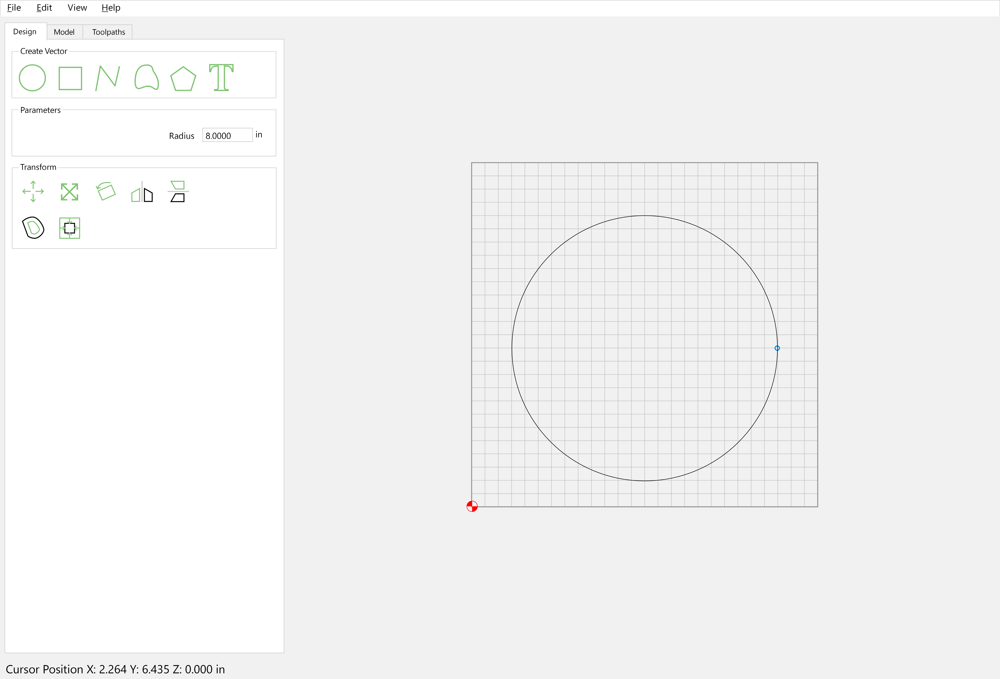
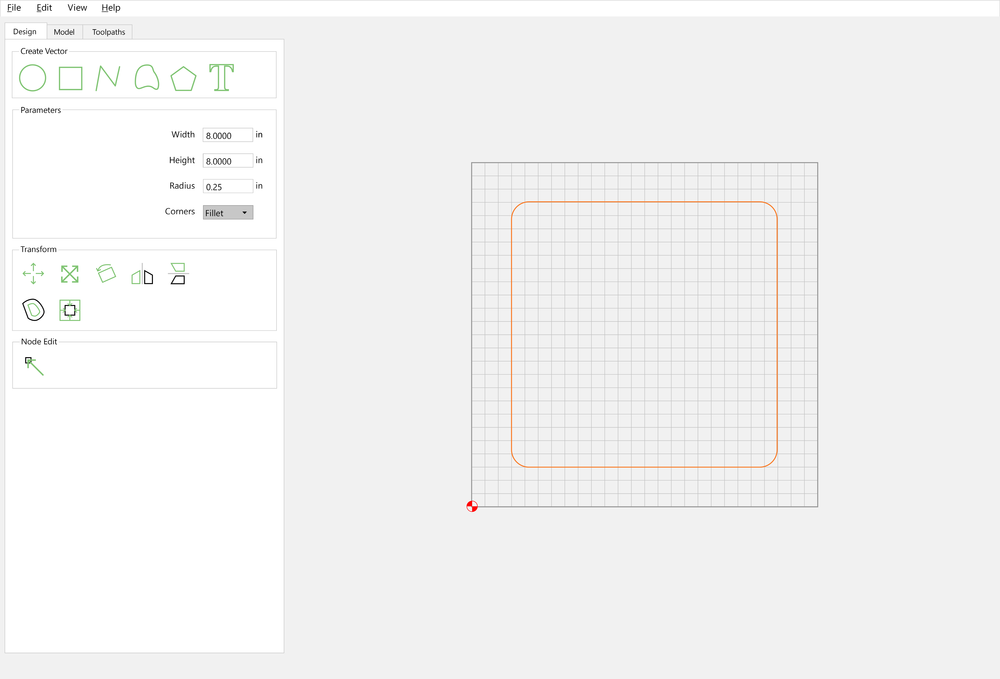
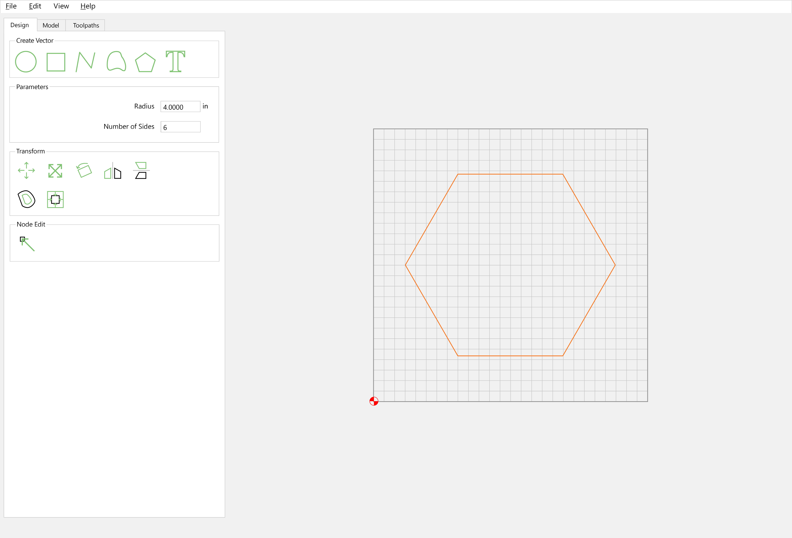
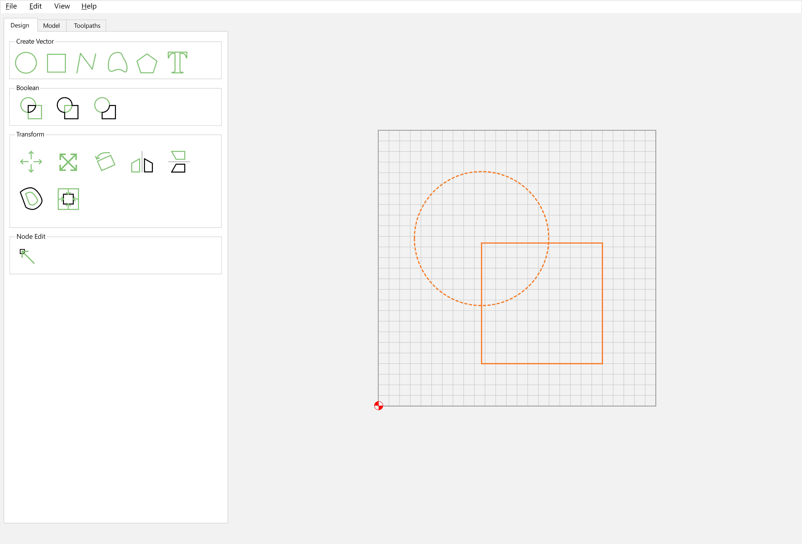
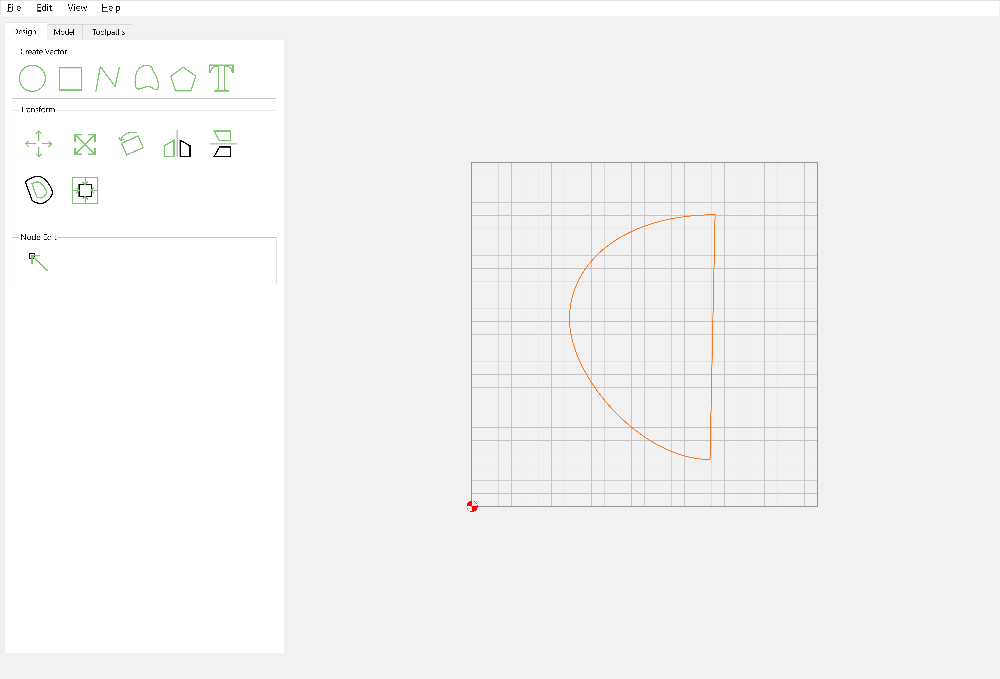
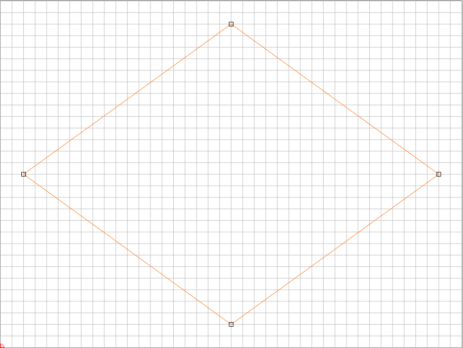
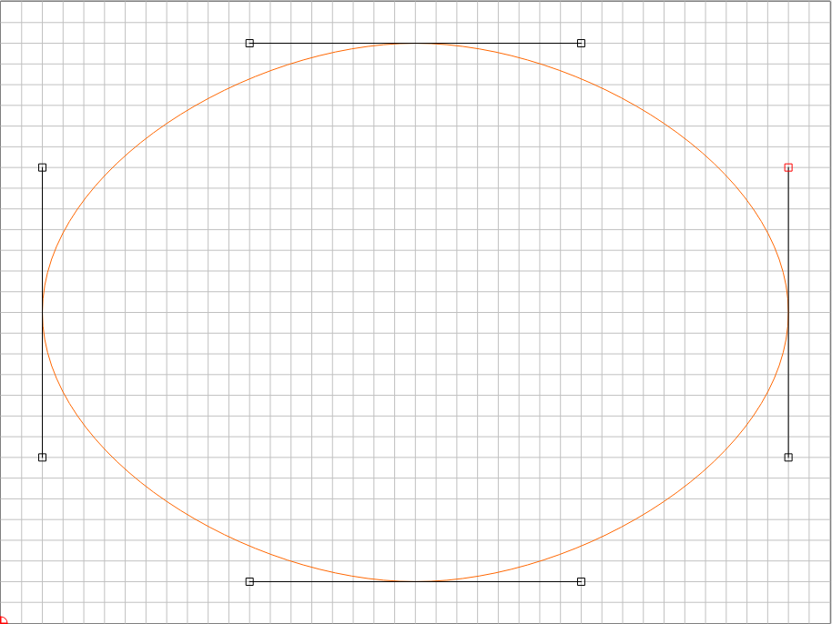
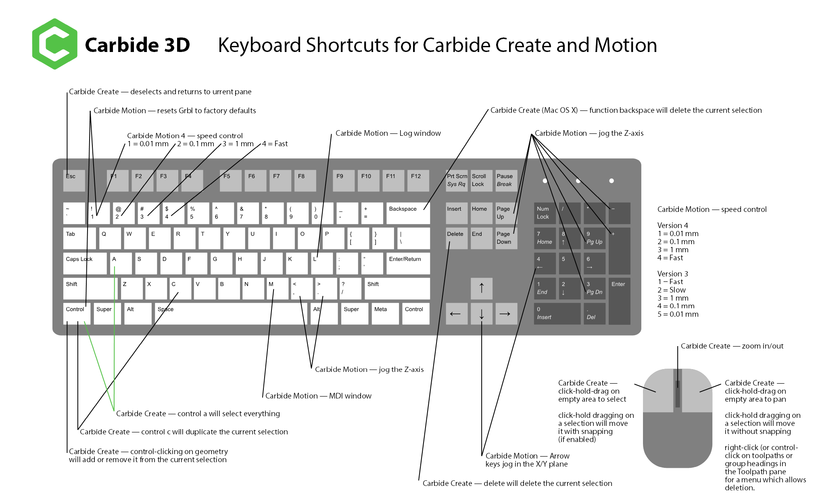

# 2D Drawing

As noted previously, before one can make a part, one must define the geometry of the design. This is done using classic geometric constructs, and possibly curves defined mathematically (but usually drawn up in a CAD or Bézier curve drawing program). We will use Carbide Create as a specific example (available from: [https://carbide3d.com/carbidecreate/](https://carbide3d.com/carbidecreate/) — note that some features may only be available in the current beta: [https://carbide3d.com/carbidecreate/beta](https://carbide3d.com/carbidecreate/beta) (if there is an open beta currently in testing) and that there are older, unsupported versions at: [https://carbide3d.com/downloads](https://carbide3d.com/downloads) and [https://carbide3d.com/carbidecreate/download6](https://carbide3d.com/carbidecreate/download6)), but the concepts would apply to any CAD or vector drawing program and will be explored first.

<figure><figcaption></figcaption></figure>

Carbide Create has two or three panes (Design, Toolpaths, and in Pro mode, Model). As with most drawing tools, there are menus for commands or different program functions/states, a palette of tools, and a work area, which includes a graphical representation of the "Stock" which is the material which will be cut away to make a design or part, and on the Stock there are lines for a grid which may be re-sized or hidden. The initial view has no objects which may be manipulated, these may be added as described below. Later versions add a pair of rulers around the drawing area and a status bar.

Like most graphical applications there is a standard set of menus, **File** which allows making new files, opening existing files, saving the current file, or exporting geometry as an SVG file, or in Carbide Create Pro, exporting the 3D model as a PNG file, printing the vector design (note that such a print may be used to make a PDF), or to quit the application. The **Edit** menu affords various copy and selection options, Undo and Redo, (note that while there is a command for Show Layers, that pane is persistent in current versions), as well as access to the Tool Database or to Select Post Processor. The **View** menu controls the view of the drawing area, as well as enabling or disabling Snap to Grid (keyboard shortcut for turning this on/off is F4) and High Resolution Simulation. Lastly, a **Help** menu has About, Register, and Help options.

Note that the interface in Carbide Create is contextual, certain commands will only appear when nothing is selected, while others only when a single object is selected, while still others only make sense to show when multiple objects are selected and may have further requirements for usage such as the objects overlapping.

## Points

The most basic geometric construct as noted by Euclid in [_Elements_](https://mathcs.clarku.edu/~djoyce/java/elements/elements.html)_:_ [_Book I_](https://mathcs.clarku.edu/~djoyce/java/elements/bookI/bookI.html)_:_ [_Definition 1_](https://mathcs.clarku.edu/~djoyce/java/elements/bookI/defI1.html) is a point in coordinate space (most CAD tools and vector drawing applications use Cartesian coordinates, see: [https://gamemath.com/book/cartesianspace.html](https://gamemath.com/book/cartesianspace.html)) ― some CAM tools allow one to assign a drilling operation at a point, but many vector editors disallow a point as an individual stand-alone entity, instead, they are used as a building block for everything else. Carbide Create does _not_ allow the creation of single points, so one would create a circle to define the perimeter of a hole which one wished to machine, or the center of which would define the point at which one wished to drill (see below).

Points of course will be used to define the Cartesian X, Y coordinates of all geometry in the design. Toolpaths will then allow specifying Z, extending this into the third dimension. Note that in some circumstances the term “Node” will be used for a point.

## Lines

Straight lines are a fundamental building block of vector drawing and are of course defined as the shortest distance between two points (Euclid’s _Elements: Book I:_ [_Definitions 2–5_](https://mathcs.clarku.edu/~djoyce/java/elements/bookI/bookI.html#defs)). Some CAM tools (including Carbide Create) will allow one to assign various toolpaths to lines, and if not directly on the line, the offset will be determined by which point is the origin and which is the final point (which is to say, the path direction) and whether the offset is to the left- or right-hand of the path direction. Carbide Create allows one to draw lines as unclosed paths, by choosing either the Polyline (or Curve) tool:

.png>)

clicking at the beginning (as well as if desired, intermediary) and end points:

<figure><figcaption>
Carbide Create drawing line with Polyline tool.
</figcaption></figure>

and then clicking on **Done** (Note that returning to the first point will also complete the Polyline or Curve as a closed path). Note that open lines on the default layer in Carbide Create will be indicated by being magenta when not selected, as opposed to the black of closed paths. Paths which are on layers which have an assigned color other than black will be drawn in that color without consideration for open or closed status. The current selection is drawn in orange, and if there are more than one element/group selected, the most recently added will be considered the Key Object which will be indicated by being drawn with a dashed highlight.

Open polylines (or curves, see below) have limited functionality in terms of Toolpaths in Carbide Create, since they may only be used with Contour toolpaths. Usually, one will work with closed paths, since they define regions which one may then assign suitable toolpaths to. There are commands for editing polylines when they are selected in addition to the normal transforms (see below) ― since the edits possible are a subset of those for the Curve tool, and the editing interface makes it possible to convert a polyline into a curve, this is discussed in the **Curve** tool section below.

Lines will be used to define Rectangles (which may be squares) and regular Polygons as described below.

Note that it is important that a given element not cross back upon itself, or have superimposed/repeated sections — the latter is of especial concern for imported files and can cause the automatic joining of elements in a DXF to become problematic, as well as interfering with the calculation of toolpaths.

## Arcs

Many CAD programs will allow the definition of arcs which are easily drawn and may be specified in several ways — an origin point, end point, and a point of rotation are typical. Carbide Create does not have an arc tool, but they may be made using Node Editing or Trim Vectors or Boolean operations as parts of circles and geometry based on circles (segments and so forth), as fillets when rounding the corners of a rectangle (see below), or drawn using the **Curve** tool (see below), or arrived at by Node Editing a circle or other object, though since they are represented as either Curves or Polylines will necessarily be approximations of an actual arc of a circle.

## Polylines

Polylines are made up of multiple points describing lines and may either be open or closed as noted above. Note that there are multiple ways to represent a given figure, and the capabilities and interface options will be different based on how it was created (so long as it has not been edited). For example, a square may have corner options if drawn using the **Rectangle** tool and may be scaled, changed to a rectangle by altering one dimension parameter or other, but if drawn with the regular **Polygon** tool, may be changed into another polygon or resized proportionally, and if drawn using the **Polyline** or **Curve** tool may only be resized proportionally (or asymmetrically by dragging or unchecking the Keep Proportions checkbox) or Node-Edited (which are possible with the other creation options).

### Open Paths

As noted above, open paths are indicated by being magenta when on the Default layer and not selected. They may be made up of lines, arcs, curves, or some combination thereof. Toolpaths may be assigned to open paths, and the directionality will determine any offset if needed for a toolpath (as well as setting climb vs. conventional in CAM tools which afford that option). Open paths are necessarily limited in the toolpaths which may be assigned, and it will typically not be possible to assign any but the most basic of operations to them. In Carbide Create, open paths may be converted to closed by using the **Join Vectors** command (see Curve Editing below) and it is also possible to combine two (or more) open paths drawn in Carbide Create into a single path, open or closed.

Note that in build 527 Carbide Create gained a feature for adding all open paths to the current selection: [https://blog.carbide3d.com/2021/carbide-create-527/](https://blog.carbide3d.com/2021/carbide-create-527/)

Edit | Select... | Select Open Vectors

<figure><figcaption></figcaption></figure>

### Closed Paths

**Closed Paths** meet back at the point of origin and open up additional operations in Carbide Create and most other CAM tools. In Carbide Create they are indicated by being black when on the Default layer and not selected. In Euclid’s _Elements: Book I:_ [_Definition 13–14_ ](https://mathcs.clarku.edu/~djoyce/java/elements/bookI/defI13.html)they are described as a defined boundary comprising a figure. Like to **Open Paths**, they may be made up of lines, arcs, curves, or some combination. Often applications will have especial support for regular polygons, allowing their creation or definition quickly and efficiently. Carbide Create has specific support for **Circles**, **Rectangles** (which may be squares), and Regular **Polygons**.

#### Circles

Circles are defined in Euclid’s _Elements: Book I:_ [_Definition 15–17_](https://mathcs.clarku.edu/~djoyce/java/elements/bookI/defI15.html) as a plane figure with one line equidistant from a point, _c.f._, [_Book III_](https://mathcs.clarku.edu/~djoyce/java/elements/bookIII/bookIII.html). In Carbide Create one draws circles from the inside out, clicking first at the center point, then on a point at the perimeter to define the radius (and by extension, diameter):

<figure><figcaption>
Carbide Create drawing a circle.
</figcaption></figure>

Note that in 810 and later it is possible to shift-click to create a circle from edge-to-edge.

Note that the **Done** button allows one to cancel out of the circle drawing mode.

Note that circles, as other shapes made with tools specific to a shape such as rectangles and regular polygons have a center point in addition to their cardinal nodes, and midpoints at the intercardinal directions.

In Carbide Create, circles are defined as four Bézier curves (as opposed to using arcs) which is necessarily an approximation of a perfect circle, but one with an error so small as to not matter for practical purposes. Researching the math involved in this differentiation is left as an exercise for the interested reader.

One limitation of circles in current versions of Carbide Create is that they may not be rotated. A work-around for this is to put one node on a grid point, go into Node Edit mode, move the node, then move it back, converting the Circle into a Curve object which describes the same geometry as the original circle, but which is no longer described by its radius.

Note that in build 527 Carbide Create gained a feature for adding circles which are within a certain size range to the current selection: [https://blog.carbide3d.com/2021/carbide-create-527/](https://blog.carbide3d.com/2021/carbide-create-527/)

Edit | Select... | Select Circles

 (1) (1) (1).png>)

One may select the minimum and maximum diameter for adding circles to the current selection which will include circles drawn with the native circle tool, circles drawn as Bézier curves, and polylines which approximate a circle.

#### Rectangles and Squares

Named as quadrilaterals in Euclid’s _Elements: Book I:_ [_Definition 19_](https://mathcs.clarku.edu/~djoyce/java/elements/bookI/defI19.html), rectangles have a specific tool for their creation; squares may be defined by making height and width equal, and in Carbide Create rectangles have a corner feature which other shapes do not.&#x20;

.png>)

Carbide Create draws from corner-to-corner by default in 830 and later, but will draw from center-to-corner when one holds the control (or command) (or shift) keyboard modifier.

In the same fashion as other shapes which have specific support in Carbide Create, rectangles will have a center point which may be interacted with, as well as a midpoint along each side.

### Polygons

Drawing programs often have support for regular polygons, as does Carbide Create. As with other objects in Carbide Create, Polygons are drawn from the center point out, unless the Shift modifier key is held which allows drawing Corner-to-Corner:

<figure><figcaption>
Carbide Create drawing a hexagon.
</figcaption></figure>

Once drawn, they may be adjusted in their dimensions, and for their number of sides, see below.

In common with circles and rectangles, regular polygons will have a center (necessary since they are defined by radius) as well as a midpoint for each segment which may be interacted with.

### Parameters

The most basic change is simply selecting an object and modifying dimensions, but other properties and features may be available.

#### A Note on Dimensions

In Carbide Create, either inches or millimeters may be selected as the unit for measurement under Job Setup.

In v7, it becomes possible to enter dimensions as calculations, so typing 2\*2= will result in the dimension being set to 4 using the current units.

It is also possible to enter dimensions in terms of specified units (naturally, numbers entered without a specified unit are assumed to be in the current coordinate system, but note that that will change the dimension if the units assigned to the project are changed for such calculations which are persistent, e.g., Toolpath Max Depth), so if in metric mode, typing 1in= will result in the dimension being set to 25.4mm, while in Imperial (inches) mode, typing 25.4mm= will result in the dimension being set to 1in, and similarly, specifying a formulae using such units is advised as best practice.

It is also possible to reference the current stock dimensions:

* h == Stock Height
* w == Stock Width
* t == Stock Thickness

using those letters (note that they are not case-sensitive, so _H_, _W_, and _T_ may be used interchangeably) when using an expression which may be evaluated using the = key, so typing _t_= will result in the dimension being set to the current thickness, or typing _t_ will leave the dimension set thus when setting up or editing a toolpath, and will dynamically update the dimension when stock thickness is changed for toolpaths. Mathematical expressions may also be used thus, so half the thickness may be referenced using _t_/2.

See: [https://community.carbide3d.com/t/how-to-use-the-height-width-and-thickness-variables-in-a-design/61155](https://community.carbide3d.com/t/how-to-use-the-height-width-and-thickness-variables-in-a-design/61155)

#### Circle Parameters

For a circle, the size parameter adjustment may be done in terms of its overall size using the **Resize** tool, or by adjusting its **Radius**:

#### Rectangle Parameters

Rectangles may also be modified in their dimensions, but one is not limited to a regular square, **Width** and/or **Height** may be specified separately:

.png>)

Note that in addition to the dimensions, one may change the shaping/appearance of corners. The possible options are:

* _Square_ (the default shown above)
* _Fillet_ (rounded corners which allow applying an arc to a given corner)
* _Chamfer_ (45-degree angles)
* _Flipped fillet_ (quarter circles removed from corners)
* _Dogbone_ (placing a circle up against the corner so as to ensure that after cutting with a round endmill a part with a right-angle corner will still fit)
* _Tee_ (placing a semicircle at a corner to ensure that a part with right-angle corners will still fit ― note that orientation may not be specified, but by adding the feature, then rotating the part, this may be controlled)

Once a corner treatment is specified, one may set its dimension in terms of the radius/diameter/distance from the corner:

#### Polygon Parameters

Polygons may be adjusted for Radius (since only regular polygons are supported, only one measurement need be specified) and number of sides:

## View

It is possible to zoom in/out using the scroll wheel on a mouse, or by using pinch gestures on a trackpad. There are also three commands, two of which have keyboard shortcuts which control the view:

* Fit to Job --- f --- this sets the view to encompass the entire stock area and any elements which extend beyond it
* Fit View to Stock (this is in the View menu only) --- sets the view to the Stock area
* Fit View to Selection --- ctrl/command f --- zooms in/out to the currently selected object

In the absence of traditional scroll bars, panning may be done by right-click dragging.

## Text

Not geometry, but many drawing and CAD programs allow setting text. Carbide Create affords this:

<figure><figcaption></figcaption></figure>

<figure><figcaption></figcaption></figure>

Text objects are limited to a single line of text in Carbide Create, and one may select the font from among those outline (OpenType or TrueType format) fonts installed on the computer Carbide Create is running on, selecting Bold and or Italic (which will be applied if the appropriate font variation is installed on the system), setting the Font Height, modifying the Spacing and setting the Alignment.

When initially selected, a text object will not bring up the properties of the Text tool. It is necessary to either select the Text tool to access these properties, or to double-click on the text object.

It is also possible to convert text to curves using the button, "Convert to Curves" --- once converted to curves, the underlying geometry may be manipulated. See: [https://carbide3d.com/blog/merging-script-fonts-in-carbide-create/](https://carbide3d.com/blog/merging-script-fonts-in-carbide-create/)

Another option is to set the text on an arc, rather than all in a straight line. When doing so, alignment may be used to control where on the arc the text will appear:

<figure><figcaption></figcaption></figure>

which has one checkbox to enable it, and another to move the text to the bottom:

<figure><figcaption></figcaption></figure>

and two controls, one which allows setting the center for the arc, the other for where the text is aligned against. Using the shift key when dragging will move both controls in unison.

If more than one line of text is needed, they may be created/positioned using the Linear Array feature described below.

## Measurements

Some CAD and drawing programs include a measurement tool. Carbide Create added one in v7:

<figure><figcaption></figcaption></figure>

Click on the two points which one wishes to measure to/from:

<figure><figcaption></figcaption></figure>

and the coordinates of the two points, the distance between them, and the angle between them will be displayed.

As an alternative to this, a line may be drawn, and when selected will afford the size and the X- and Y- dimensions.

## Selection

There are multiple ways to select objects:

* click to select --- this will select a single object
* shift click to add (or remove) an object from the current selection
* click-drag --- this will make a selection of the objects within the drag-rectangle --- note that there are two directions to drag, and they are meaningful: down is selective and will only include objects completely within the drag-rectangle, while up is promiscuous and will include any object partially are wholly within the drag-rectangle
* menu entries to select object according to certain criteria such as Edit | Select All which will select all objects

Note that when selecting there are certain special points which may be used for selection or snapping, and which will afford useful options for precision movement and placement:

Circles afford the option to select the center in addition to the cardinal points:

<figure><figcaption></figcaption></figure>

and the midpoints of the arcs:

<figure><figcaption></figcaption></figure>

Rectangles and regular polygons will allow the use of midpoints along the edges:

<figure><figcaption></figcaption></figure>

<figure><figcaption></figcaption></figure>

## Transformations

Geometry may be adjusted in a number of ways:

* Moved to a different location in the drawing area
* Resized or scaled to a different size/proportion
* Rotated
* Flipped along an axis (Carbide Create affords tools for horizontal and vertical)
* Aligned, either to another piece of geometry or the defined Stock

Another option which drawing programs may afford is offsetting ― this is especially important for Carbide Create since it allows one to adjust the geometry in terms of the radius or diameter of the endmill (see below). Naturally, a selected object may be deleted, either by pressing the Delete (or Backspace) key, or using the cut (ctrl/command x) command to remove it from the drawing area and copy it into memory.

It is also possible to edit objects as noted below.

### Move

When selecting geometry in Carbide Create and selecting **Move**, the X and Y coordinates may be entered, and the reference point selected from the proxy point (indicated by the highlighted/selected circle), and will move the object so the referred corner is at that point when the Apply button is pressed (the dialog may be cancelled by selecting Done):

<figure><figcaption></figcaption></figure>

### Resize

In addition to moving, geometry may also be altered in size. Selections may be scaled symmetrically using the hollow square drag handles at the corners or by using the numeric interface ― midpoints of the selection marquee afford asymmetric scaling by dragging instead (this is a simple way to create an ellipse/oval) and later versions add a checkbox, "Keep Proportions" which makes it possible to scale asymmetrically numerically (note that drag-scaling will snap to the grid and can afford a similar precision):

<figure><figcaption></figcaption></figure>

### Rotate

Objects may be rotated. This is often useful for decorative designs, and, may be required to control part orientation when cutting or doing mechanical design, or to adjust for orientation of T-bones. Note that for some objects it may be better to alter their size rather than rotating them by 90 or −90 degrees in certain programs if the rotation operation should change the objects into Curve objects, removing the ability to interact with their formal parameters.

At this time in Carbide Create, Circle objects will not alter their orientation when rotated, only positioning. If using the nodes for positional information is required, it will be necessary to convert them to Curve objects by Node Editing.

See also the Circular Array tool below.

### Mirror

Objects may be mirrored (flipped) horizontally or vertically. Useful for decorative designs, it also allows (for instance) the creation of reversed geometry for creating stamps or printing blocks or branding irons or creating a mirror of a part for cutting it as an inlay, or cutting a part from the bottom orientation.

### Align

Most, if not all CAD and design tools allow an option for aligning one or more objects. Typically, if only one object is selected, the alignment is against the drawing area, in the case of Carbide Create, against the Stock. Alignment affords precision, and control, especially when one is using Rotation.

In Carbide Create, if multiple objects are selected and stock is not used to align against, the alignment will be against the key object (indicated by being drawn with a dashed highlight).

### Spacing

Another option for alignment is to space elements horizontally or vertically. This was added to Carbide Create in the 760 build:

<figure><figcaption></figcaption></figure>

<figure><figcaption></figcaption></figure>

or for vertical:

<figure><figcaption></figcaption></figure>

<figure><figcaption></figcaption></figure>

### Offset Path

Geometry may be selected and offset, either to the inside or outside:

.png>)

When offsetting paths to the outside in Carbide Create, corners are rounded off to match the distance specified as a radius. This allows one to instantiate as geometry the path which would be assigned to an endmill when cutting out a shape. If sharp corners are desired, either draw the design at the largest possible size and inset only, or export to an SVG, do the offsetting operation in a third-party tool such as Inkscape, and then reimport, or, redraw the geometry.

### Boolean Operations

Booleans allow for the modification of geometry using existing geometry. Named for the British Mathematician George Boole: [https://www.britannica.com/biography/George-Boole](https://www.britannica.com/biography/George-Boole), they result in new figures based on a logical interaction of two or more figures, so the interface for them only appears when two or more objects are selected (the green indicates the geometry which will be produced by the operation, the black what is used and which is normally replaced by the result):

Depending on the selection, Carbide Create affords the following Boolean operations:

* **Union** ― the current selection (two or more objects) will be added together, creating a new object which is the outermost perimeter of the selection
* **Intersection** ― only available when two objects are selected, the new object will be that area included within both objects
* **Subtraction** ― the key object (indicated by a dashed highlight) will be removed from each of the other object(s) in the selection

Note that in most programs, the selection is modified, so if the original geometry will be needed after, it may be necessary that the objects be duplicated in alignment with the originals.

<figure><figcaption></figcaption></figure>

Note that Carbide Create does afford two checkbox options:

* Keep Original Vectors (which removes the need to duplicate and align before the operation)
* Group Output (which avoids the need to do so after)

If a given operation does not have the desired result, undoing it in older versions of Carbide Create will change which object is the current key object (indicated by a dashed highlight) ― reattempting the operation would then do so based on that new aspect of the selection with different results than previously if applicable to the operation. In current versions it will be necessary to recreate the selection, but the blue preview and bar of operation types and sub-types should allow one to get exactly the desired result (if possible with the current selection and implementation of Boolean operations).

## Curves

Curves are available in most vector drawing programs, and when present may be defined in several ways.

### Bézier Curves

The most common is Bézier curves ([https://en.wikipedia.org/wiki/B%C3%A9zier\_curve](https://en.wikipedia.org/wiki/B%C3%A9zier_curve)), named for the automotive designer Pierre Bézier, which are defined by an on-curve point (the origin), a matching off-curve point, and an additional off-curve point paired with the ultimate (ending) on-curve point. Carbide Create uses Bézier curves in its Curve tool. Note that points are termed as Nodes in the various Curve tool options.

To create a curve, select the Curve tool, then click or click-drag where one wants on-curve points (clicking creates sharp nodes, click-dragging creates smooth nodes, with the click placing the on-curve node, and the drag-release determining the position of the off-curve nodes ― either smooth or sharp nodes may be changed to the other, see below):

.png>)

#### Open or Closed Paths

Once a Curve (or Polyline) is created it may be either open (indicated by being magenta when not selected) and made by clicking Done in the Curve tool, or closed (black) which is done by clicking on the initial point or continuing that click as a drag to define the positioning of the off-curve nodes. Open paths may be closed using the **Join Vectors** command:

.png>)

Note that the beginning and ending nodes will be connected as directly as possible:

and it may be necessary to adjust the curve if the path crosses itself.

As of Carbide Create build 627 it is possible to change a closed path to an open path by right-clicking and using the Cut Vector command while in Node Edit mode (see below). Note that often, rather than an open path, one wants a closed path which describes the region which would cut with an open path --- it is possible to use Boolean operations to create a closed geometry which describes where one wishes to cut: [https://community.carbide3d.com/t/deleting-line-help/32956](https://community.carbide3d.com/t/deleting-line-help/32956)

#### Principles for Bézier Curves

Bézier Curves should be drawn following some basic principles unless a design dictates otherwise:

* on-curve nodes should be at extrema (north/south (top/bottom), or east/west (left/right)) and at points of inflection (where a shape changes direction, such as at the middle of an _S_ curve)
* curves are smoothest when off-curve nodes follow the “Rule of 30” and are approximately one-third (\~30 percent) of the distance towards the next on-curve node

#### Node Edit Mode

The underlying points of geometry may be modified by selecting it and choosing **Node Edit** Mode:

.png>)

As noted above, geometry is made up of lines and/or curves which are bounded by on-path nodes, and for curves, have a pair of off-path nodes which determine how the curve is drawn.

When in Node Edit Mode it is possible to:

* add an on-path node by right-clicking on a part of the path which does not have nodes and choosing _Insert Node_ — keyboard shortcut _i_
* delete an on-path node (when it is selected) by right-clicking and choosing _Delete Node_ — keyboard shortcut _d_ for the currently selected node(s)
* set one or more nodes to be smooth (indicated by a circle) by selecting and then right-clicking and choosing _Set Smooth_ or using the keyboard shortcut _s_ for the currently selected node(s)
* set one or more nodes to be sharp, retracting the associated off-curve nodes by right-clicking and choosing _Set Sharp_ or using the keyboard shortcut _v_
* set one or more nodes to cusp, setting the off-curve nodes to project at an angle, allowing them to be dragged asymmetrically by right-clicking and choosing _Set Cusp_ or using the keyboard shortcut _u_
* cut open a path (which will convert a closed path to an open one) by right-clicking and choosing _Cut Vector_ or using the keyboard shortcut _c_

Off-path nodes (indicated by small, filled circles) may be dragged to reshape the sections of curves associated with smooth nodes, and by holding the Alt (Option) key, dragged without affecting the other off-path node for the associated on-path node creating a sharp node and/or asymmetry.

A forum post on this:



For the underlying mathematics see the video:

[https://www.youtube.com/watch?v=aVwxzDHniEw](https://www.youtube.com/watch?v=aVwxzDHniEw)

#### Corner Tool

Version 633 of Carbide Create adds a Corner Tool:

<figure><figcaption></figcaption></figure>

which allows one to modify corners to have a specified radius:

<figure><figcaption></figcaption></figure>

only angles which will admit a portion of a circle of the specified radius will be eligible:

<figure><figcaption></figcaption></figure>

#### Trim Vectors

A frequent feature in CAD programs is the ability to trim overlapping vectors which was added in version 636:

<figure><figcaption></figcaption></figure>

which allows one to remove segments as defined by overlapping:

<figure><figcaption></figcaption></figure>

.png>)

Once trimmed, the geometry will necessarily become one or more open paths:

.png>)

It is frequently helpful to use this feature to create sections of geometry from multiple elements which may then be connected using the _Join Vectors_ command as discussed below.

#### Geometric Interactions

With Boolean Operations and the Trim Vector Tool a number of possible interactions are possible. Given a set of curves, for example a rectangle with a circle superimposed:

.png>)

Boolean Union results in:

.png>)

Boolean Intersection:

.png>)

and there are two possibilities for Boolean Subtraction depending on the key object:

Circle as key object:

.png>)

Rectangle as key object:

.png>)

while the Trim Vectors command allows one to trim the various vectors which overlap:

.png>)

.png>)

allowing one to make asymmetrical designs which are not easily done with Boolean operations, and which would require additional geometry (or editing the geometry to be used beforehand):

.png>)

A further consideration is that the Trim Vectors command results in Curve objects which may be joined, and which will not result in polylines:

.png>)

#### Drawing Tutorials

A very basic drawing task is to draw an oval. Originally this tutorial was available at: [http://community.carbide3d.com/t/lets-draw-an-ellipse-with-new-users/4194](http://community.carbide3d.com/t/lets-draw-an-ellipse-with-new-users/4194) — and is provided here in an updated form.

Start by launching Carbide Create — in Job Setup (gear icon) set the width of the drawing area to 20″, the height to 15″, and go into Job Setup | Document background | Edit Ensure the grid spacing is 0.50″. Download the following file:

Placing it on the background layer scaled so that it fills the entire drawing area (scaling to 0.557 should work) and lines up with the grid. Ensure that Snap to Grid is enabled.

Select the **Curve** tool and click on each of the four points of the placed image, clicking again on the first to close the path.

Download and place the image below on the background scaled as before:

Select the path and go into **Node Edit** Mode and right-click on each node and select "Toggle Smooth" (or press the _s_ key) and drag the off-curve nodes to match the positioning of the background image.

The following additional drawing tutorials are available:

* [https://community.carbide3d.com/t/lets-make-a-b-for-anyone/14223](https://community.carbide3d.com/t/lets-make-a-b-for-anyone/14223) — drawing more complex forms with the Curve tool
* [https://community.carbide3d.com/t/how-to-draw-a-compass-rose/16170](https://community.carbide3d.com/t/how-to-draw-a-compass-rose/16170) — using rotation
* [https://community.carbide3d.com/t/how-to-draw-a-star-carbide-create/16022](https://community.carbide3d.com/t/how-to-draw-a-star-carbide-create/16022)
* [https://community.carbide3d.com/t/six-ways-to-round-a-corner/53827](https://community.carbide3d.com/t/six-ways-to-round-a-corner/53827)

and if one has difficulty drawing up anything, either post on the Carbide 3D community forums: [https://community.carbide3d.com/](https://community.carbide3d.com/) or e-mail in to [support@carbide3d.com](mailto:support@carbide3d.com) and we will do our best to assist.

There is also the game:



which is a useful tutorial and exercise, though to facilitate gameplay, it shows many incorrect constructions.

### Quadratic B-Splines

A curve which alternates on-curve and off-curve nodes, B-Splines are used for TrueType fonts, since their calculation is efficiently done, but are not used in typical CAD or Bézier curve drawing applications because of the difficulty in editing them. Note that when TrueType fonts are converted to paths, conversion from B-Splines to Bézier curves may result in odd node placement.

## Arrangement

There are of course several possible arrangements for multiple pieces of geometry:

* Adjacent/coincident/superimposed --- the geometries are actually touching along some edges
* Overlapping/intersecting --- the geometries overlap or intersect
* Nesting --- each piece of geometry either contains, or is contained by the other piece(s) of geometry
* No interaction --- geometries do not interact in any fashion

Best practice is for geometries to either nest or have no interaction --- the other two possibilities have potential interactions and implications which will be discussed in [Toolpaths](toolpaths.md).

## Other Features

CAD and drawing programs may have a number of other features, depending on their intended use. Some of these include:

### Job Setup (gear icon)

This allows setting:

* Stock size: Width (X), Height (Y) — note that the minimum dimension is 25mm, maximum 200 inches
* Model Resolution (for the 3D model in Pro mode)
* Stock Thickness (Z)
* Zero Height: Top or Bottom
* Toolpath Zero: Lower-Left, Center-Left, Top-Left, Center
* Material and Machine --- these are legacy settings and have no effect
* Retract height --- also termed Safety height, this is how much the machine will lift in-between toolpaths
* Units: Inch or millimeters

<figure><figcaption></figcaption></figure>

### Set Grid

This allows setting the spacing of the grid, or by checking or unchecking a checkbox, showing or hiding it.

.png>)

### Set Background

It is possible to load a background image as noted above and use it as a reference. For further specifics see: [https://community.carbide3d.com/t/importing-a-file-or-a-backgound-image/27166](https://community.carbide3d.com/t/importing-a-file-or-a-backgound-image/27166)

### Group Vectors/Ungroup Vectors

When two or more objects are selected, the command **Group Vectors** becomes available:

.png>)

which will then group the current selection so that it may be selected and manipulated as a unit.

This may be undone using the command **Ungroup Vectors**:

.png>)

### Layers

Carbide Create supports layers since version 521. Available under Edit | Show Layers in versions prior to build 814:

.png>)

(or using the alphabetic keyboard shortcut _l_)

it then affords the ability to create and name layers (or delete them), as well as to color-code them (by clicking on the color swatch in current versions):

.png>)

and to move objects to specific layers and to hide/show, or lock/unlock layers, or set a layer to be "Active" (which will cause all new objects to be created on that layer).

<figure><figcaption></figcaption></figure>

Since Build 814, the layer functionality has moved to a persistent pane beneath the tool area:

<figure><figcaption></figcaption></figure>

and all layer functionality is accessible from the icons associated with each layer, including functionality for the palette as a whole (so to make a new layer, click on the gear icon button for _any_ layer), as well as functionality specific to the layer associated with the gear icon button:

* Activate
* Select all on Layer
* Move Selection to Layer
* Rename
* Hide/Show
* Lock
* Delete
* Move Up
* Move Down

The color swatch for a given layer may be clicked on to bring up a dialog to change the color used for that layer. It is also possible to toggle the icons for show/hide and lock/unlock by double-clicking on them.

A Layer is an organizational tool which allows one to separate geometry and colour-code it​ and may exist in one of several states:

* **ACTIVE** (indicated by being bold, must also be unlocked and visible/not-hidden) --- all new objects will be created on the ACTIVE layer. Double-clicking on a layer will set it to be the **ACTIVE** layer.
* Hidden (indicated by strike-through)
* Locked (indicated by closed padlock)
* not ACTIVE --- elements may be selected/manipulated, but adding elements to a layer is done by using the menu to move the current selection to the desired layer

​How they are used, depends on a given project and how a user wishes to approach it:

* a two-sided job might have separate layers for each side ​
* a file with multiple parts might have each part on a separate layer
* a file with multiple tools or which has different types of toolpaths or toolpaths which cut to different depths might have the geometry for each tool/toolpath type/depth on a separate layer, and use the Toolpath facility to associate a toolpath w/ a layer ​
* a file which is created from an auto-tracing might have the initial version duplicated and moved to a separate locked layer for reference

or, any other usage which assists in working with geometry and other elements in the application.

### Duplication and Arrays

A useful feature in many drawing or CAD programs is the ability to duplicate or create arrays of objects. Carbide Create affords four options for this:

* Copy/Paste ― a selection may be copied into memory and then pasted, either centered on the current cursor location, or if the cursor is not within the drawing area, stacked on top of the original
* Duplicate ― Edit | Duplicate Selected (ctrl or command d), this allows placing duplicates by clicking and affords a series of checkboxes which allow one to Keep Groups, Keep Toolpath Links, and/or Duplicate to Current Layer
* Linear ― allows rectangular arrangements
* Circular ― allows polar arrangements

To create an array, select one or more objects, invoke the desired command, and then specify the parameters for the array.

#### Linear Arrays

<figure><figcaption></figcaption></figure>

<figure><figcaption></figcaption></figure>

#### Circular Arrays

<figure><figcaption></figcaption></figure>

<figure><figcaption></figcaption></figure>

Circular Arrays afford a number of options and are well-suited to creating geometry which requires symmetry. For example, a five-pointed star may be easily drawn by rotating a triangle to have 5 instances (one original, the selected orange dashed key object, and four copies):

.png>)

and then drawing multiple overlapping polylines using the tips of the rotated triangles which defines the star shape:

.png>)

and Boolean unioning them:

.png>)

### File Notes

Carbide Create 7 added the feature of adding notes to a file:

<figure><figcaption></figcaption></figure>

Such notes may have the option of always showing when the file is opened as a reminder:

 (1) (1).png>)

### Tabs

Carbide Create 7 moves Tabs to the Design pane:

<figure><figcaption></figcaption></figure>

which may then be instantiated in the Toolpath pane using Contour toolpaths (and their settings adjusted), or ignored by unchecking the appropriate checkbox.

## Geometry

When drawing and modeling it is often necessary to place parts relative to the original positioning based on a distance and possibly rotation determined by the dimensions of the parts. Geometry and trigonometry allow the calculation of such positioning, usually in terms of right triangles, or chords for elements based on circles or segments of circles.

There are of course several different sorts of triangles depending on the specifics of their angles and the length of their sides.

By length:

* scalene ― all sides are different lengths
* isosceles ― two sides are the same length
* equilateral ― all three sides are the same length

By angles:

* right triangle ― one angle is 90 degrees (may also be an isosceles or scalene triangle)
* oblique ― no angle is equal to 90 degrees
* obtuse ― one angle is greater than 90 degrees
* acute ― all angles are less than 90 degrees

Depending on the angles and the orientation of a given triangle, various labeling may be appropriate.

For specific triangles, different formulae apply.

We begin of course with the Pythagorean theorem:

$$
a^2 + b^2 = c^2
$$

which allows us to determine the length of one side of a right triangle, given the lengths of the other two sides.

$$
c = \sqrt{a^2 + b^2}
$$

$$
b = \sqrt{c^2 - a^2}
$$

$$
a = \sqrt{c^2 - b^2}
$$

All the possible formulae for calculating the lengths of the sides of a right triangle are:

Similarly, the angles of a right triangle may be calculated by:

<figure><figcaption>
Formulae for calculating the angles of a right triangle.
</figcaption></figure>

Projects involving circles are usually calculated in terms of chords, radius, and the height of the chord segment.

Websites for this sort of thing:

* [https://www.mathportal.org/calculators/plane-geometry-calculators/right-triangle-calculator.php](https://www.mathportal.org/calculators/plane-geometry-calculators/right-triangle-calculator.php)
* [https://www.wermac.org/others/convert\_right\_triangle\_calculation.html](https://www.wermac.org/others/convert_right_triangle_calculation.html)
* [http://ambrnet.com/TrigoCalc/Circle3D.htm](http://ambrnet.com/TrigoCalc/Circle3D.htm)
* [https://mathopenref.com/arcradius.html](https://mathopenref.com/arcradius.html)
* [https://www.omnicalculator.com/construction/taper](https://www.omnicalculator.com/construction/taper)

## Additional Features

Beyond just drawing, vector drawing and CAD/CAM programs may have many additional features which go beyond just manipulating geometry or other elements. Many are adjuncts to Toolpaths but are mentioned here since there is often an element of geometrical editing which they address. They are divided between bundled and being only available in the Pro version. A few which Carbide Create has include (it is possible that additional feature(s) may be in betas which are still in testing):

* Image Tracing --- rather than manually re-draw a pixel image: [https://community.carbide3d.com/t/carbide-create-re-drawing/15811](https://community.carbide3d.com/t/carbide-create-re-drawing/15811) it is possible to import a pixel image and auto-trace it: [https://community.carbide3d.com/t/carbide-create-image-tracing/31208](https://community.carbide3d.com/t/carbide-create-image-tracing/31208) (note that tracing is inherently black and white, on/off, and that it may be necessary to adjust the Threshold setting and trace multiple times in order to capture all details of an image, see: [https://community.carbide3d.com/t/how-to-use-multiple-image-traces-to-capture-all-details-in-an-image/65714](https://community.carbide3d.com/t/how-to-use-multiple-image-traces-to-capture-all-details-in-an-image/65714)).

<figure><figcaption></figcaption></figure>

* STL Import --- this is a feature in Pro, which allows importing an STL centered on the geometry which is selected when it is imported: [https://community.carbide3d.com/t/instructions-on-how-to-3d-carve-using-cc-v7-pro/48906/12](https://community.carbide3d.com/t/instructions-on-how-to-3d-carve-using-cc-v7-pro/48906/12)
* Inlay — originally made available at [https://community.carbide3d.com/t/inlay-mode-for-carbide-create/59115](https://community.carbide3d.com/t/inlay-mode-for-carbide-create/59115) since then, a new inlay mode has become standard: [https://community.carbide3d.com/t/inlay-update-in-carbide-create/78451](https://community.carbide3d.com/t/inlay-update-in-carbide-create/78451)
* Tiling --- another Pro feature: [https://community.carbide3d.com/t/toolpath-tiling-in-carbide-create-pro/59334](https://community.carbide3d.com/t/toolpath-tiling-in-carbide-create-pro/59334) this may be done manually as noted at: [https://community.carbide3d.com/t/tiling-questions-issues/14352/5](https://community.carbide3d.com/t/tiling-questions-issues/14352/5)
* Toolpath Volume --- another Pro feature, this allows one to know in advance how much epoxy will be needed to fill a given toolpath: [https://community.carbide3d.com/t/carbide-create-beta-760/68493/23](https://community.carbide3d.com/t/carbide-create-beta-760/68493/23)
* Post Processor --- this is a concept specific to CAM tools. G-code is available in many dialects, so an application will use a post-processor to adapt the specifics of the G-code to match the dialect used by the firmware in a specific machine. Carbide Create affords four post-processors: Basic G-code --- this should be simple enough to work in pretty much any machine, Grbl --- this is the firmware used by Carbide 3D machines (and many others) and should work in any machine which uses that G-code interpreter (note that Grbl uses LinuxCNC as a reference implementation, which in turn uses Mach 3, which is a de facto industry standard, so this should work for a wide variety of machines), and Carbide 3D Nomad/Shapeoko --- these post-processors support Carbide 3D machines, and all of the possible accessories, including the BitRunner or VFD spindle (affording tool on/off and possibly speed control), or the BitSetter (which allows for measurement of tool length offset and tool changes). Note that there is an option for programming custom post-processors: [https://carbide3d.com/hub/faq/create-pro-custom-post-processor/](https://carbide3d.com/hub/faq/create-pro-custom-post-processor/)

## Resources

For further information on Carbide Create please see:

* [https://carbide3d.com/files/pdf/carbide-create-v5.pdf](https://carbide3d.com/files/pdf/carbide-create-v5.pdf) (the official manual for v5)
* [https://carbide3d.com/hub/courses/create/](https://carbide3d.com/hub/courses/create/) (a collection of tutorial videos on the 2D aspects)
* [https://carbide3d.com/hub/courses/create-pro/](https://carbide3d.com/hub/courses/create-pro/) (a collection of videos on the features added by the Pro licensing mode)
* [http://community.carbide3d.com/c/software/carbide-create](http://community.carbide3d.com/c/software/carbide-create) (a community forum)
* [https://community.carbide3d.com/c/tutorials/14](https://community.carbide3d.com/c/tutorials/14) (a list of tutorials, mostly for Carbide Create)
* [https://carbide3d.com/carbidecreate/shortcuts](https://carbide3d.com/carbidecreate/shortcuts)

* [https://community.carbide3d.com/t/keyboard-cheat-sheet-for-carbide-create-and-motion/7839](https://community.carbide3d.com/t/keyboard-cheat-sheet-for-carbide-create-and-motion/7839)
* [https://old.reddit.com/r/shapeoko/wiki/carbidecreate](https://old.reddit.com/r/shapeoko/wiki/carbidecreate) (a wiki page)
* [https://carbide3d.com/blog/carbide-create-node-editing/](https://carbide3d.com/blog/carbide-create-node-editing/)
* [https://carbide3d.com/blog/create-v8/](https://carbide3d.com/blog/create-v8/)
* [https://carbide3d.com/blog/create-big-file-update/](https://carbide3d.com/blog/create-big-file-update/)
* [https://carbide3d.com/blog/carbide-create-v7/](https://carbide3d.com/blog/carbide-create-v7/)
* [https://carbide3d.com/blog/carbide-create-v6-done/](https://carbide3d.com/blog/carbide-create-v6-done/)
* [https://carbide3d.com/blog/carbide-create-v6-is-almost-ready/](https://carbide3d.com/blog/carbide-create-v6-is-almost-ready/)
* [https://carbide3d.com/blog/merging-script-fonts-in-carbide-create/](https://carbide3d.com/blog/merging-script-fonts-in-carbide-create/)
* [https://carbide3d.com/blog/carbide-create-v6/](https://carbide3d.com/blog/carbide-create-v6/)
* [https://carbide3d.com/blog/carbide-create-527/](https://carbide3d.com/blog/carbide-create-527/)
* [https://carbide3d.com/blog/layers-in-carbide-create/](https://carbide3d.com/blog/layers-in-carbide-create/)
* [https://carbide3d.com/blog/carbide-create-413-released/](https://carbide3d.com/blog/carbide-create-413-released/)
* [https://carbide3d.com/blog/carbide-create-400/](https://carbide3d.com/blog/carbide-create-400/)
* [https://carbide3d.com/blog/carbide-create-316/](https://carbide3d.com/blog/carbide-create-316/)
* [https://carbide3d.com/blog/carbide-create-315/](https://carbide3d.com/blog/carbide-create-315/)
* [https://carbide3d.com/blog/carbide-create-311/](https://carbide3d.com/blog/carbide-create-311/)
* [https://carbide3d.com/blog/carbide-create-310/](https://carbide3d.com/blog/carbide-create-310/)
* [https://carbide3d.com/blog/carbide-create-308/](https://carbide3d.com/blog/carbide-create-308/)
* [https://carbide3d.com/blog/carbide-create-307/](https://carbide3d.com/blog/carbide-create-307/)
* [https://carbide3d.com/blog/carbide-create-306/](https://carbide3d.com/blog/carbide-create-306/)
* [https://carbide3d.com/blog/carbide-create-305/](https://carbide3d.com/blog/carbide-create-305/)
* [https://carbide3d.com/blog/carbide-create-304/](https://carbide3d.com/blog/carbide-create-304/)
* [https://carbide3d.com/blog/carbide-create-303/](https://carbide3d.com/blog/carbide-create-303/)
* [https://carbide3d.com/blog/carbide-create-302/](https://carbide3d.com/blog/carbide-create-302/)
* [https://carbide3d.com/blog/carbide-create-301/](https://carbide3d.com/blog/carbide-create-301/)
* [https://carbide3d.com/blog/carbide-create-290/](https://carbide3d.com/blog/carbide-create-290/)
* [https://carbide3d.com/blog/carbide-create-build-289/](https://carbide3d.com/blog/carbide-create-build-289/)
* [https://carbide3d.com/blog/carbide-create-289/](https://carbide3d.com/blog/carbide-create-289/)
* [https://carbide3d.com/blog/big-carbide-create-update/](https://carbide3d.com/blog/big-carbide-create-update/)
* [https://carbide3d.com/blog/Carbide-Create-Now-With-V-Carving/](https://carbide3d.com/blog/Carbide-Create-Now-With-V-Carving/)

## Third Dimensional Shapes

Extending all of these into 3 dimensions becomes more complex with each additional element, each of which complicates the mathematics.

The Toolpaths pane of Carbide Create affords a number of options to realize 2D geometry as 3D elements cut away from the stock: [https://willadams.gitbook.io/design-into-3d/toolpaths](https://willadams.gitbook.io/design-into-3d/toolpaths) and the Pro mode adds even more: [https://willadams.gitbook.io/design-into-3d/3d-modeling-from-2d-geometry](https://willadams.gitbook.io/design-into-3d/3d-modeling-from-2d-geometry)

Up through arcs and regular curves, these are usually manageable, as is expressed in constructive solid geometry (CSG), and OpenSCAD (and its Blockly derivative BlockSCAD, or fork (Open)PythonSCAD [https://pythonscad.org/](https://pythonscad.org/)) is essentially a scripting front-end for this. Extending arbitrary curves into 3-dimensional space involves complex geometric calculations which are the domain of 3-dimensional modeling tools such as Blender or Dune 3D or FreeCAD and various commercial programs such as Alibre [https://www.alibre.com/](https://www.alibre.com/). Fortunately, the regular polygons and extruded shapes of CSG afford one a very wide array of design options.
