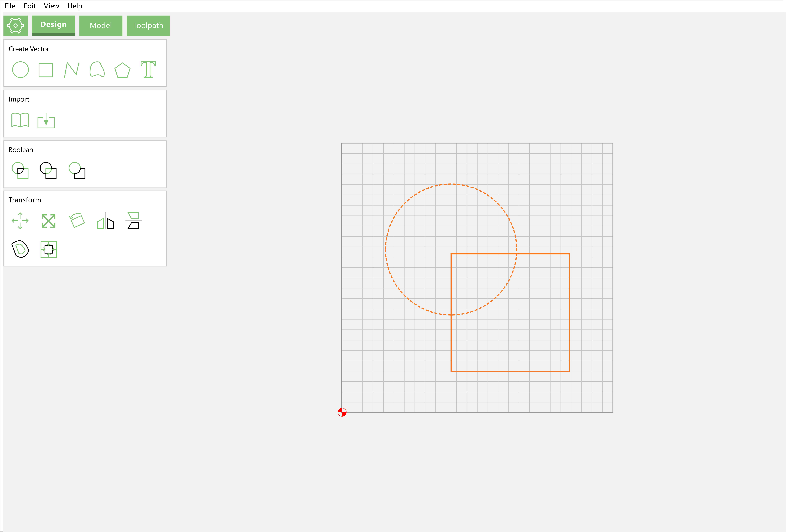

# 2D Drawing

Before one can make a part, one must define the geometry of the design. This is done using classic geometric constructs, and possibly curves defined mathematically \(but usually drawn up in a CAD or Bézier curve drawing program. We will use Carbide Create as a specific example \(freely available from: [https://carbide3d.com/carbidecreate/](https://carbide3d.com/carbidecreate/)\), but the concepts would apply to any CAD or vector drawing program and will be explored first.

As with most drawing tools, there are menus for commands or different program functions/states, a palette of drawing tools, and a work area.

## Points

The most basic geometric construct as noted by Euclid in [_Elements_](https://mathcs.clarku.edu/~djoyce/java/elements/elements.html)_:_ [_Book I_](https://mathcs.clarku.edu/~djoyce/java/elements/bookI/bookI.html)_:_ [_Definition 1_](https://mathcs.clarku.edu/~djoyce/java/elements/bookI/defI1.html) is a point in coordinate space \(most CAD tools and vector drawing applications use Cartesian coordinates\) ― some CAM tools allow one to assign a drilling operation at a point, but many vector editors disallow a point as an individual stand-alone entity, instead, they are used as a building block for everything else. Carbide Create does not allow the creation of single points, so one would create a circle to define the perimeter of the circle which one wished to machine \(see below\).

Points of course will be used to define the Cartesian X, Y coordinates of all geometry in the design. Toolpaths will then allow specifying Z, extending this into the 3rd dimension. Note that in some circumstances the term “Node” will be used for a point.

## Lines

Straight lines are a fundamental building block of vector drawing and are of course defined as the shortest distance between two points \(Euclid’s _Elements: Book I:_ [_Definitions 2–5_](https://mathcs.clarku.edu/~djoyce/java/elements/bookI/bookI.html#defs)\). Some CAM tools \(including Carbide Create\) will allow one to assign various toolpaths to lines, and if not directly on the line, the offset will be determined by which point is the origin and which is the final point \(path direction\). Carbide Create allows one to draw lines as unclosed paths, by choosing either the Polyline \(or Curve\) tool:

clicking at the beginning and end points:

and then clicking on "Done". Note that open lines in Carbide Create will be indicated by being magenta when not selected, as opposed to the black of closed paths. The current selection is drawn in orange.

Due to the limited toolpath support, open polylines \(or curves, see below\) are not typically used in Carbide Create, instead one will re-work closed paths so that they have suitable geometry. There are commands for editing polylines when they are selected in addition to the normal transforms \(see below\) ― since the edits possible are a subset of those for the Curve tool, and the editing interface makes it possible to convert a polyline into a curve, this is discussed in the Curve tool section below.

Lines will be used to define Rectangles \(which may be squares\) and regular Polygons as described below.

## Arcs

Many CAD programs will allow the definition of arcs which are easily drawn and may be specified in several ways — an origin point, end point, and a point of rotation are typical. Carbide Create does not have an arc tool, but they may be made using Boolean operations as parts of circles, or drawn using the Curve tool \(see below\).

## Polylines

Polylines are made up of multiple points describing lines and are differentiated by being open or closed. Note that there are multiple ways to represent a given figure, and the capabilities and interface options will be different based on how it was created, and if it has been edited. For example, a square may have corner options if drawn using the Rectangle tool and may be changed to a rectangle by altering one dimension parameter or other, but if drawn with the regular Polygon tool, may be changed into another polygon or resized proportionally, and if drawn using the Polyline or Curve tool may only be resized proportionally or node-edited \(which to a degree are possible with the other creation options\).

### Open Paths

As noted above, toolpaths may be assigned to open paths, and the directionality will determine any offset. Open paths are necessarily limited in the toolpaths which may be assigned, and it will typically not be possible to assign any but the most basic of operations to them. In Carbide Create, open paths may be converted to closed by using the Join command \(see Curve Editing below\) but there is no mechanism at this time in Carbide Create for combining two \(or more\) open paths into a single path, open or closed. 

### Closed Paths 

Closed paths meet back at the point of origin and open up additional operations in CAM tools. In Euclid’s _Elements: Book I:_ [_Definition 13–14_ ](https://mathcs.clarku.edu/~djoyce/java/elements/bookI/defI13.html)they are described as a defined boundary comprising a figure. They may be made up of lines, arcs, curves, or some combination. Often tools will have especial support for regular polygons, allowing their creation or definition quickly and efficiently. Carbide Create has specific support for Circles, Rectangles \(which may be squares\), and Regular Polygons.

#### Circles

Circle are defined in Euclid’s _Elements: Book I:_ [_Definition 15–17_](https://mathcs.clarku.edu/~djoyce/java/elements/bookI/defI15.html) __as a plane figure with one line equidistant from a point, _c.f._, [_Book III_](https://mathcs.clarku.edu/~djoyce/java/elements/bookIII/bookIII.html). In Carbide Create one draws circles from the inside out, clicking first at the center point, then on a point at the perimeter to define the radius \(and diameter\):

Note that the **Done** button allows one to cancel out of the circle drawing mode.

Circles are defined as four Bézier curves which is necessarily an approximation of a perfect circle, but one with an error so small as to not matter for machining purposes.

#### Rectangles and Squares

Named as quadrilaterals in Euclid’s _Elements: Book I:_ [_Definition 19_](https://mathcs.clarku.edu/~djoyce/java/elements/bookI/defI19.html), rectangles have a specific tool for their creation, squares may be defined by making height and width equal, and in Carbide Create they have a corner feature which other shapes do not. As circles are, they are drawn from the inside out in Carbide Create:

Since Carbide Create draws from center out, shapes are often twice the desired dimensions, in such instances they may be easily scaled to half their size \(this applies to other shapes and is often useful/expedient\) so as to have them at the intended size.

### Polygons

Drawing programs often have support for regular polygons, as does Carbide Create. As other objects, Polygons are drawn from the centerpoint out:

Once drawn, they may be adjusted in their dimensions, and for their number of sides, see below.

### Parameters

Once shapes have been drawn, they may be selected and changed or modified. The most basic change is simply modifying their dimensions, but other properties and features may be available.

#### Circle Parameters

For a circle, the size parameter adjustment may be done in terms of its overall size \(either Width or Height, only one may be adjusted, the other will be forced to match when **Apply** is clicked\), or Radius:

#### Rectangle Parameters

Rectangles may also be modified in their dimensions, but one is not limited to a regular square, Width and/or Height may be specified separately:

Note that in addition to the dimensions, one may change the shaping/appearance of corners. The possible options are:

* Square \(the default shown above\)
* Fillet \(rounded corners\)
* Chamfer \(45 degree angles\)
* Flipped fillet \(quarter circles removed from corners\)
* Dogbone \(placing a circle up against the corner so as to ensure that after cutting with a round endmill a part with a right angle corner will still fit\)
* Tee \(placing a semicircle at a corner to ensure that a part with right angle corners will still fit --- note that orientation may not be specified, but by adding the feature, then rotating the part this may be controlled\)

Once a corner treatment is specified, one may set its dimension in terms of the radius/diameter:

#### Polygon Parameters

Polygons may be adjusted for Width or Height \(since only regular polygons are supported, only one measurement may be specified, the other will be forced to the correct dimension\) and number of sides:

## Transformations

Geometry may be adjusted in a number of ways:

* Moved to a different location in the drawing area
* Resized or scaled to a different size/proportion
* Rotated
* Flipped along an axis \(Carbide Create affords tools for horizontal and vertical\)
* Aligned, either to another piece of geometry or the defined Stock

Another option which drawing programs may afford is offsetting ― this is especially important for Carbide Create since it allows one to adjust the geometry in terms of the radius or diameter of the endmill.

### Move

When selecting geometry in Carbide Create and selecting **Move**, the X and Y coordinates may be entered, and the reference point selected from the proxy \(indicated by the green highlighted circle\), and will move to that point when Apply is clicked:

### Resize

In addition to moving, geometry may also be transformed. Using the numeric interface selections may be scaled symmetrically ― the drag handles afford asymmetric scaling by dragging instead:

### Rotate

Objects may be rotated. This is often useful for decorative designs, and may be required to control part orientation when cutting or doing mechanical design. Note that for some objects it may be better to alter their size rather than rotating them in Carbide Create.

### Flip

Objects may be flipped \(mirrored\) horizontally or vertically. Useful for decorative designs, it also allows \(for instance\) the creation of reversed geometry for creating stamps or printing blocks or creating a mirror of a part for cutting it as an inlay.

### Align

Most, if not all CAD and design tools allow an option for aligning one or more objects. Typically if only one object is selected, the alignment is against the drawing area, in the case of Carbide Create, against the Stock. Alignment affords precision, and control, especially when one is using Rotation.

### Offset Path

Geometry may be selected and offset, either to the inside or outside:

When offsetting paths to the outside, corners are rounded off to match the distance specified as a radius. This allows one to instantiate as geometry the path which would be assigned to an endmill when cutting out a shape. If sharp corners are desired either draw the design at the largest possible size and inset only, or export to an SVG, do the offsetting operation in a 3rd party tool such as Inkscape, and then reimport, or redraw the geometry.

### Boolean Operations

Booleans allow for the instantiation of geometry from existing geometry. Named for the British Mathematician George Boole: [https://www.britannica.com/biography/George-Boole](https://www.britannica.com/biography/George-Boole), they result in new figures based on a logical interaction of two or more figures, so the interface for them only appears when two or more objects are selected \(the green indicates the geometry which will be produced by the operation, the black what is removed\):

Depending on the selection, Carbide Create affords the following Boolean operations:

* Union ― the current selection \(two or more objects\) will be added together, creating a new object which is the outermost perimeter of the selection
* Intersection ― only available when two objects are selected, the new object will be that area included within both objects
* Subtraction ― the key object \(indicated by a dashed highlight\) will be removed from each of the other object\(s\) in the selection

Note that the selection is modified, so if the original geometry will be needed after, the objects should be duplicated and dragged back into alignment with the originals.

If a given operation does not have the desired result, undoing it in Carbide Create will change which object is the current key object \(indicated by a dashed highlight\) ― reattempting the operation will then do so based on that new aspect of the selection with different results than previously.

## Curves 

Curves are omitted from some vector drawing programs, and when present may be defined in several ways. 

### Bézier Curves 

The most common is Bézier curves which are defined by an on-curve point \(the origin\), a matching off-curve point, and an additional off-curve point paired with the ending on-curve point. Carbide Create uses Bézier curves in its Curve tool. Note that points are termed as Nodes in the various Curve tool options.

To create a curve, select that tool, then click or click-drag where one wants on-curve points \(clicking creates sharp nodes, click-dragging creates smooth nodes, with the click placing the on-curve node, and the drag-release determining the position of the off-curve node ― either may be changed to the other, see below\):

Once a curve is created it may be either open \(indicated by being magenta when not selected\), or closed \(black\). Open paths may be closed using the Join command:

Note that the beginning and ending nodes will be connected as directly as possible, and it may be necessary to adjust the curve if the path crosses itself.

#### Principles for Bézier Curves

Bézier Curves should be drawn following some basic principles:

* on-curve nodes should be at extrema \(north/south \(top/bottom\) or east/west \(or left/right\)\) and at points of inflection \(where a shape changes direction, such as in the middle of an _S_ curve\)
* curves are smoothest when off-curve nodes follow the “Rule of 30” and are approximately one-third \(30 percent\) of the distance towards the next on-curve node

#### Node Edit Mode

The underlying points of geometry may be modified by selecting it and choosing Node Edit Mode:

As noted above, geometry is made up of lines and/or curves which are bounded by on-path nodes, and for curves, have a pair of off-path nodes which determine how the curve is drawn.

When in Node Edit Mode it is possible to right-click and:

* add an on-path node
* delete an on-path node
* toggle a node from smooth to sharp and vice-versa

Off-path nodes may be dragged to reshape paths, and by holding the Alt \(Option\) key, dragged without affecting the other off-path node for the associated on-path node.

#### Drawing Tutorials

The following drawing tutorials are available:

* [http://community.carbide3d.com/t/lets-draw-an-ellipse-with-new-users/4194](http://community.carbide3d.com/t/lets-draw-an-ellipse-with-new-users/4194)  — very basic tutorial on drawing with the Curve tool
* [https://community.carbide3d.com/t/lets-make-a-b-for-anyone/14223](https://community.carbide3d.com/t/lets-make-a-b-for-anyone/14223) — drawing more complex forms with the Curve tool
* [https://community.carbide3d.com/t/how-to-draw-a-compass-rose/16170](https://community.carbide3d.com/t/how-to-draw-a-compass-rose/16170https://community.carbide3d.com/t/how-to-draw-a-star-carbide-create/16022)
* [https://community.carbide3d.com/t/how-to-draw-a-star-carbide-create/16022](https://community.carbide3d.com/t/how-to-draw-a-compass-rose/16170https://community.carbide3d.com/t/how-to-draw-a-star-carbide-create/16022)

### Quadratic B-Splines

A curve which alternates on-curve and off-curve nodes, B-Splines are used for TrueType fonts, since their calculation is efficiently done, but are not used in typical CAD or Bézier curve drawing applications. Note that when TrueType fonts are converted to paths, conversion from B-Splines to Bézier curves may result in odd node placement.

## Third Dimensional Shapes

Extending all of these into 3 dimensions becomes more complex with each additional element, each of which complicates the mathematics. Up through arcs and regular curves, these are usually manageable, as is expressed in constructive solid geometry \(CSG\), and OpenSCAD is essentially a scripting front-end for this. Extending arbitrary curves into 3 dimensional space involves complex geometric calculations which are the domain of 3 dimensional modeling tools such as Blender and various commercial programs. Fortunately, the regular polygons and extruded shapes of CSG afford one a very wide array of design options.

