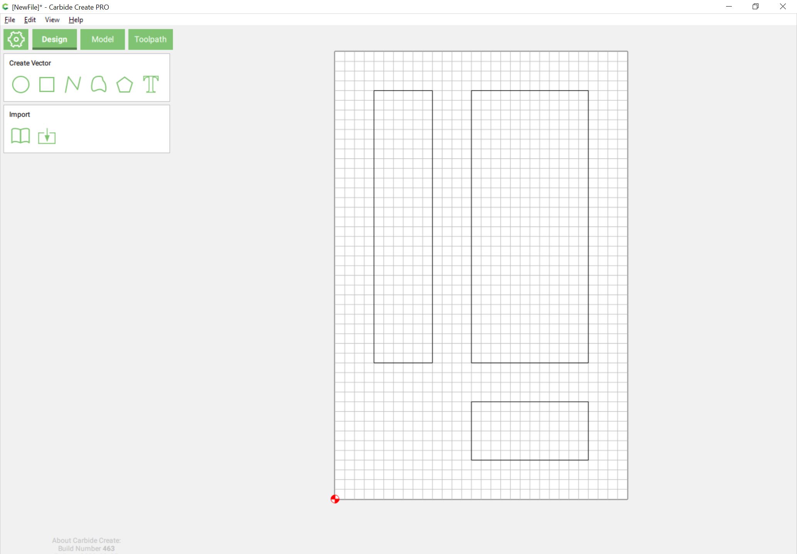
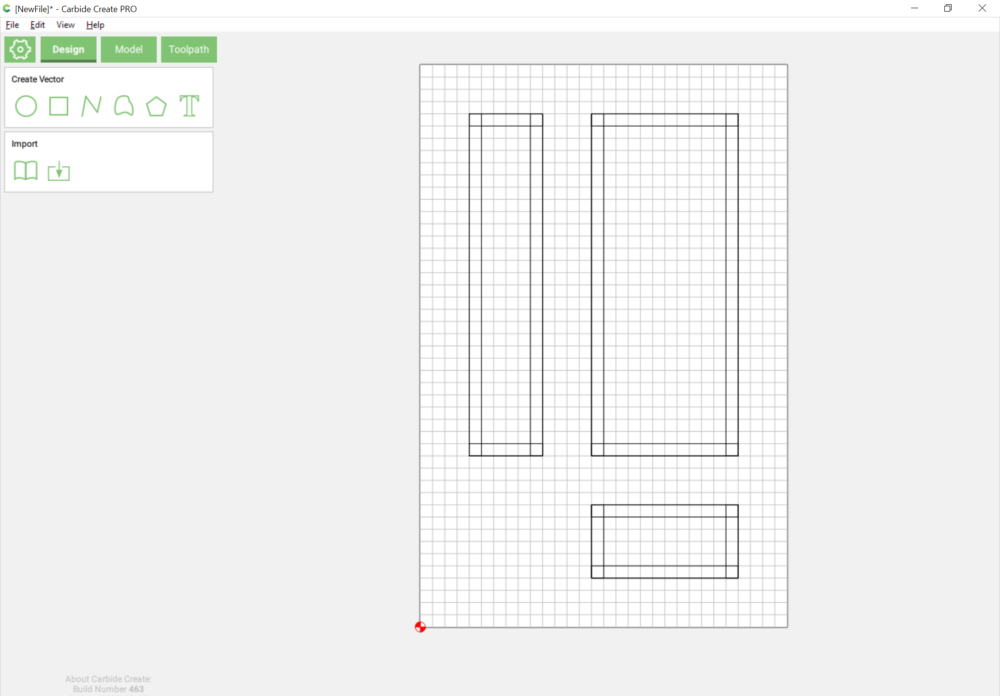
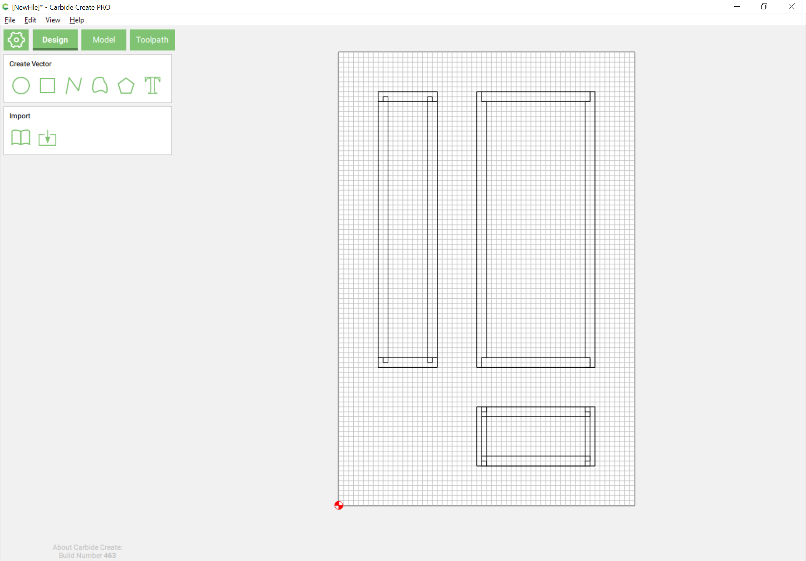
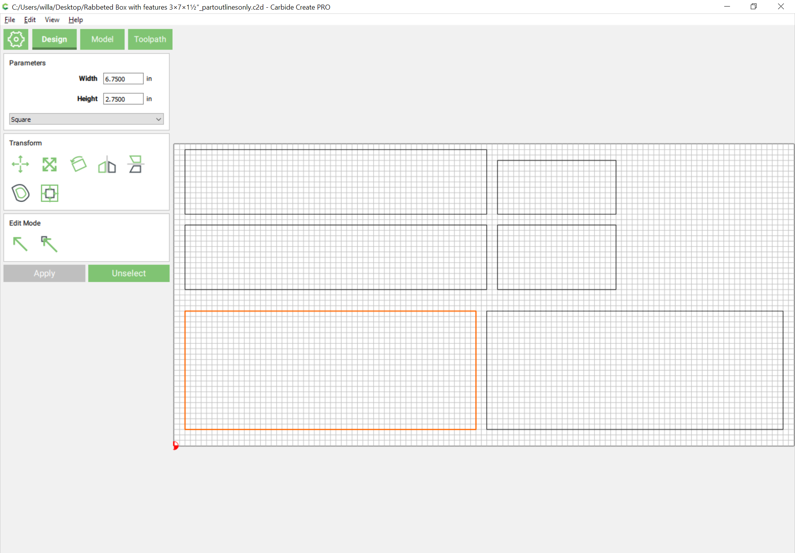
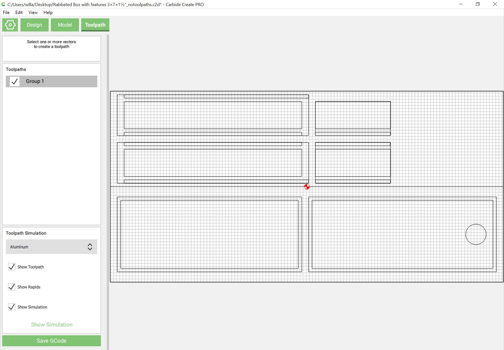
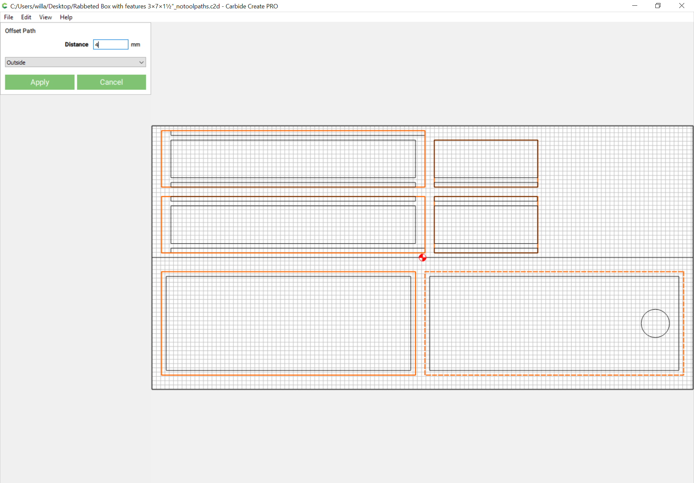
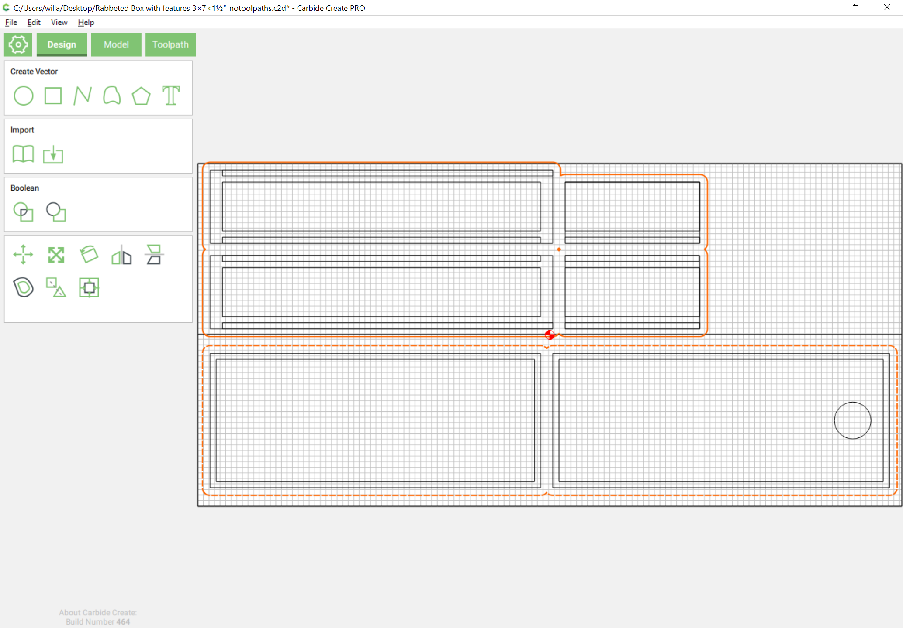
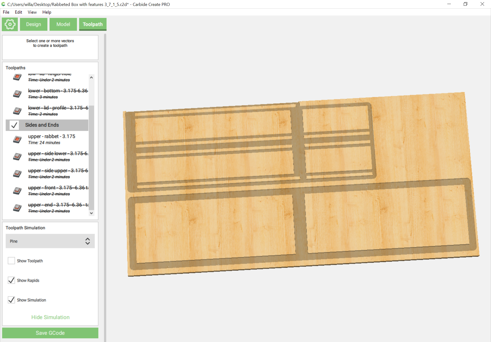

# 3D Project

Removing one or more shapes from one piece of wood, and the negative of that shape from another so that the pieces fit together is the basis of wood joinery techniques. Traditional wood joinery often takes advantage of the sharp internal geometries which are possible with saws and chisels, but working with a router in a CNC requires us to take into consideration the rounded cut which an endmill will make if it does not cut past the edge of a part or cuts into a part with an internal angle.

The first machined joint which took into account the use of round tools to join parts was the Knapp joint: [https://furnishgreen.com/fun-furniture-fact-the-knapp-joint/](https://furnishgreen.com/fun-furniture-fact-the-knapp-joint/). See: [https://community.carbide3d.com/t/knapp-joint-with-cnc/19723](https://community.carbide3d.com/t/knapp-joint-with-cnc/19723) for further details and an example file. The problem with it and similar and traditional joints \(_i.e._, dovetails, but also box/finger joints\) is that they require a CNC which will allow for a fixture for holding boards on end when cutting such as: [https://cutrocket.com/p/5cb25f3380844/](https://cutrocket.com/p/5cb25f3380844/) and will at the least require 2 setups \(clamp all four boards at once, cut one set of corner joints, repeat for opposite ends\) in addition to cutting boards to length and machining any features which one might need.

An alternative technique would be to lay the stock out flat and machine the edges so that things are not merely cut to size, but also have any necessary features cut in place and geometry along the edges which will allow parts to fit together. Finger joints are popular for this, and can be cut on a CNC if one finds the semicircular voids which are the result of cutting dogbones and similar features where necessary acceptable. For a lengthy discussion of this see: [https://community.carbide3d.com/t/design-into-3d-boxes-magazine-storage/16238](https://community.carbide3d.com/t/design-into-3d-boxes-magazine-storage/16238) \(including a work-around which will be explored later in this text\).

## The Simple Box Rabbeted Joint

One of the oldest of woodworking joints however is the rabbeted joint which fortuitously allows for this sort of thing without voids. It is so simple that it is the subject of a video, “The Simple Box” by Carbide 3D:



which is detailed at: [https://www.shapeoko.com/wiki/index.php/Carbide\_Create:\_A\_Simple\_CNC\_Box](https://www.shapeoko.com/wiki/index.php/Carbide_Create:_A_Simple_CNC_Box) and discussed at: [https://community.carbide3d.com/t/a-simple-cnc-box-in-depth/7530](https://community.carbide3d.com/t/a-simple-cnc-box-in-depth/7530). Note that there is a generator available at: [http://chaunax.github.io/projects/twhl-box/twhl.html](http://chaunax.github.io/projects/twhl-box/twhl.html) which has an OpenSCAD front-end at: [https://www.thingiverse.com/thing:3575705](https://www.thingiverse.com/thing:3575705).

A rabbeted joint has the following advantages over a simple butt joint:

* aligns along the join
* increased glue surface

Since it is cut at right angles, it is easily machined into stock which is laying flat on the machine bed, and it affords two options for orientation:

* use a smaller endmill and machine grooves trapping the lid and bottom
* use a larger endmill \(easing machining\) and depend on adhesives to secure the bottm and have a lid which lifts off

As in the video, we will do the former. 

### Dimensions

The next consideration is overall dimensions, in this case 3″ wide × 7″ deep × 1½″ high, and the thickness of the stock, ¼″. Based on those, we draw up the three different views:

Next, draw in the thickness of the material:

It is at the overlapping squares where it will be necessary to adjust the sizing of parts to accommodate rabbets and so forth. First, reduce the grid spacing to half the board thickness \(0.25" so we change grid spacing to 0.125" in this case\), then adjust parts to show the fit of the various rabbeted joints using Boolean operations:

### Parts

One may now arrange rectangles of the appropriate sizes for the six parts needed and begin modeling them by drawing in additional rectangles which represent the interior of the box:

Next, draw in the geometry necessary to model the rabbets. Basically you need to draw outlines for all the stock which will be left uncut:

\(and we've taken the liberty of drawing in the circle for the finger hole --- if this is not a through hole, then the lid would require two-sided machining operations\).

### Machining

Adding the machining operations takes us into the 3rd dimension. While one could most expediently add outline profiles only, the rabbets require additional geometry to cut their corners, and it is best practice to cut as a pocket down to tab depth.

Select the geometry for the parts and offset by a distance at least 10% greater than the diameter of the endmill which will be used:

After, an optional optimization would be to edit out the small divots in the offset path:

With the outer outlines for the rabbet/pocket made, it is simply a matter of selecting the feature geometries as well and pocketing to one-half the stock thickness:

