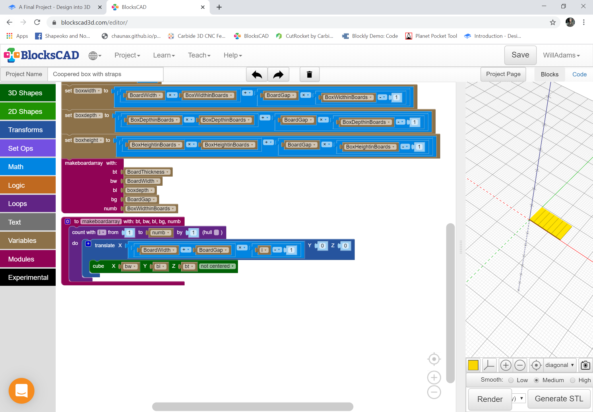

# A Final Project

While there are many guides for making coopered boxes, none of them discuss the underlying mathematics and algorithms. This project allows one to design a traditional chest made up of multiple boards, and straps of different materials. The design will use metal for the central flat straps, and leather for the edging and corner protectors.

The first consideration is the necessary parameters. Rather than using absolute/specific dimensions, the height and length and width of the project will be defined in terms of the base width of the boards, so the first parameters would be to define:

* BoardWidth
* BoardThickness
* BoardGap

In keeping things proportional, it will also be expedient to use that last value as the gap for the metal parts, but since metalwork is normally more precise we will use one-fourth that dimension.

The actual size of the base of the box will be calculated from:

* BoxWidthinBoards
* BoxDepthinBoards
* BoxHeightinBoards

In addition we will provide the following options for styles of lid:

* Flat — a plain flat lid
* Faceted — a three-sided, Mansard-style lid
* Arched — a traditional coopered \(curved, multi-piece\) lid

In order to facilitate the strapping \(for simplicity's sake it is assumed the flat strapping is the same width and thickness as the angle profile\) it will be necessary to specify the dimensions for it:

* AngleWidth
* AngleThickness

Lastly we will need to fasten things with some sort of hardware which requires that a hole is placed through the strapping — for simplicity a matching hole will not be machined during manufacture, instead it is expected that the holes will be drilled during assembly. Similarly, the actual hardware used is not specified, only the diameter of the necessary hole:

* HardwareDiameter

This yields:

In addition, since we are cutting the boards in half lengthwise for the lid parts it will be necessary to know the width of the saw kerf \(dimension of material lost to the cutting\), so add:

* SawKerf

Working in multiples of boards we need a module to create an array of boards. The inputs should be obvious, as are the calculations and looping. It will be expedient to calculate out the actual dimensions of the \(lower portion of the\) box:

* boxwidth
* boxdepth
* boxheight

Next we erect the front and back and ends:

Next is the logic for the lid, a simple if-then construct based on the allowed lid types \(which will become a drop-down menu in OpenSCAD\). Since the skirt will vary, amongst designs, but the basic version will work for multiple designs it is made into a module \(from which code will be copied for the 3-faceted version\):

