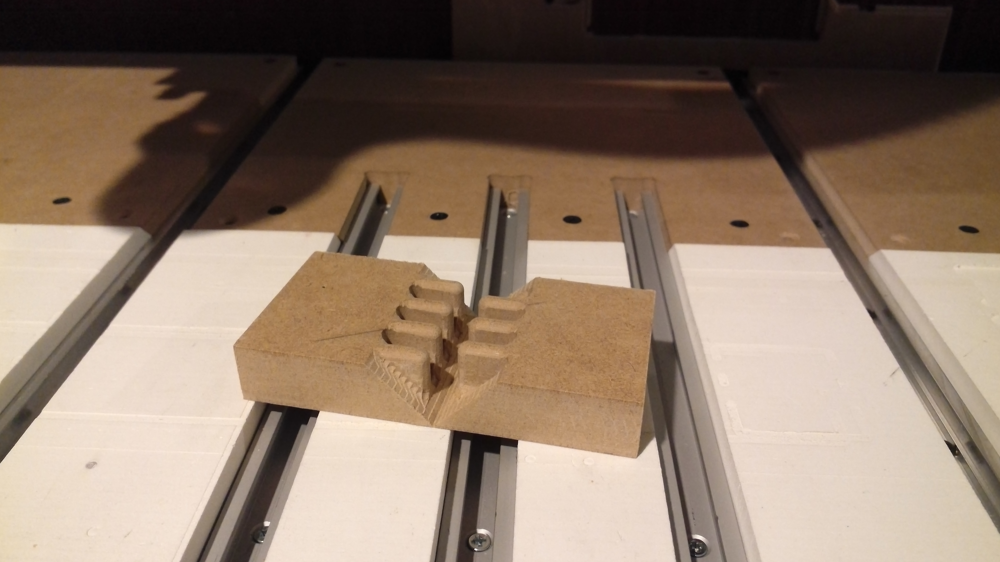
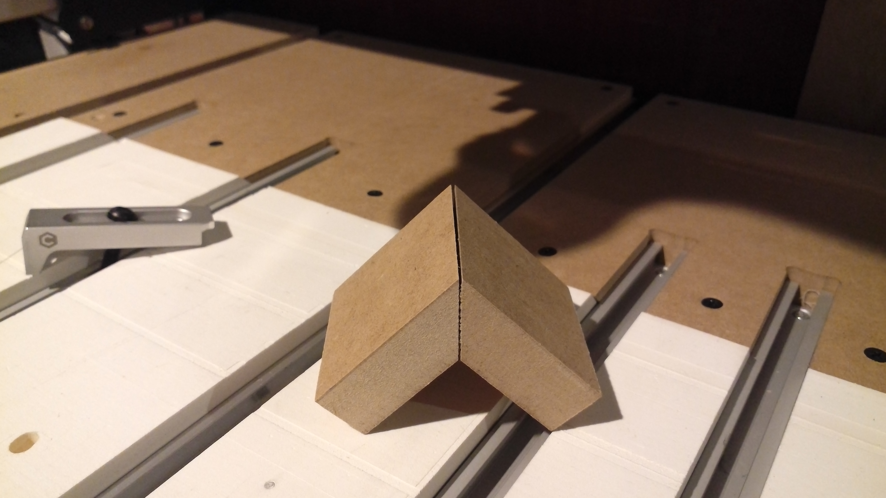

# Adjustable Modular Designs

The ideal joint would be void free and not show any endgrain, while being self-aligning and offering sufficient long-grain glue surface for strength --- the classic example of this is the blind miter dovetail which is pretty much the exclusive domain of hand tool woodworking.

A similar design would be the blind miter box or fingerjoint which has seen a number of implementations:

* [https://joinerynotebook.blogspot.com/2016/03/blind-mitered-finger-joint-boxes.html](https://joinerynotebook.blogspot.com/2016/03/blind-mitered-finger-joint-boxes.html)
* [https://www.finewoodworking.com/2012/05/05/cutting-and-fitting-a-blind-finger-joint](https://www.finewoodworking.com/2012/05/05/cutting-and-fitting-a-blind-finger-joint)
* [https://community.carbide3d.com/t/full-blind-finger-joints/947](https://community.carbide3d.com/t/full-blind-finger-joints/947)
* [https://community.carbide3d.com/t/overengineered-box-for-the-endmills-i-dont-have-yet/429](https://community.carbide3d.com/t/overengineered-box-for-the-endmills-i-dont-have-yet/429)

As the latter two links make clear, there are two possible approaches: 

* Use the radius of the endmill to define the fingers so as to minimize endgrain--endgrain connections
* Overcut with dogbones which makes the layout simpler

The former can become quite complex and requires over-cutting which creates voids, while the latter has voids designed in.

There are a couple of different features which make the joint work:

* a bisecting angle where the joint will be exposed 
* the fingerjoints, alternating so that they fit together

The fingerjoints fit together, providing a great deal of glue surface:

Fitting the bottom and lid snuggly against fingers removes the need to remove material at the top and bottom angles --- if the box is sawn in twain so that it has a V area at that point it will then be necessary to relieve the material where the V endmill cannot cut.

The initial part of the joint is made by cutting away as much of the angles as can be using a ball-nosed endmill, and machining the fingers:

Then the V angles are cut to make the miter:

Then, a cove radius endmill is used to relieve the fingers:

\(which cut Carbide Create cannot preview accurately at this time, so the tool used is simply provided with appropriate feeds and speed and set to a diameter which will show\)

Lastly the pockets for the top and bottom and relief and indicator cuts for sawing off the lid are drawn in and then suitable toolpaths applied:

