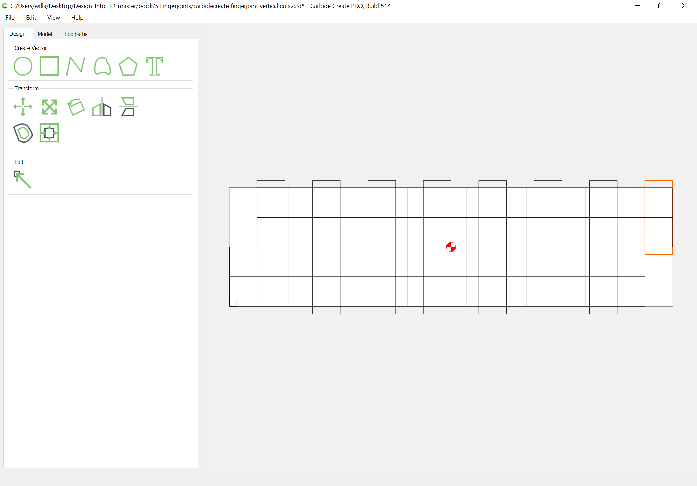
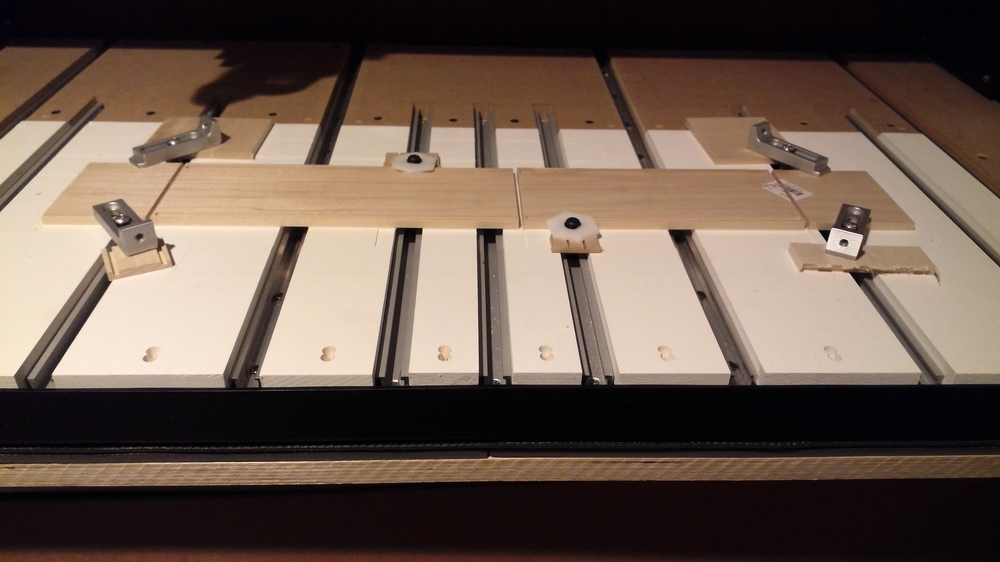
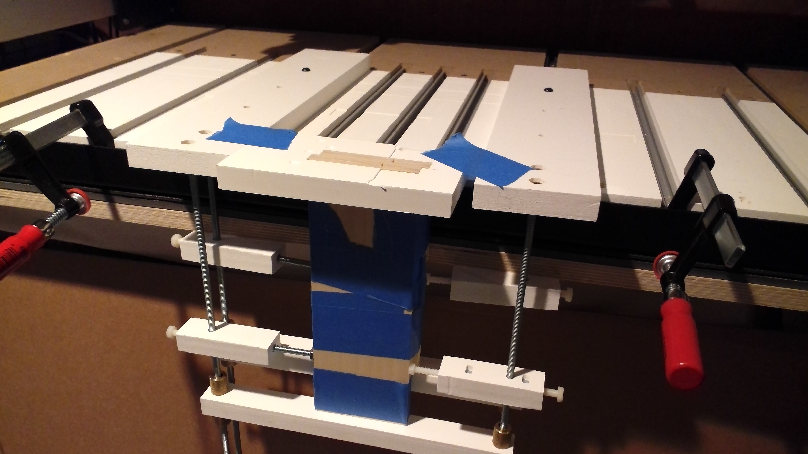
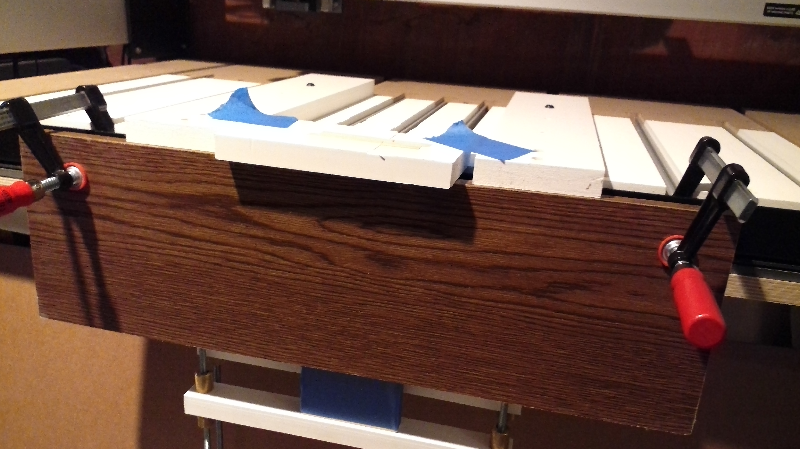
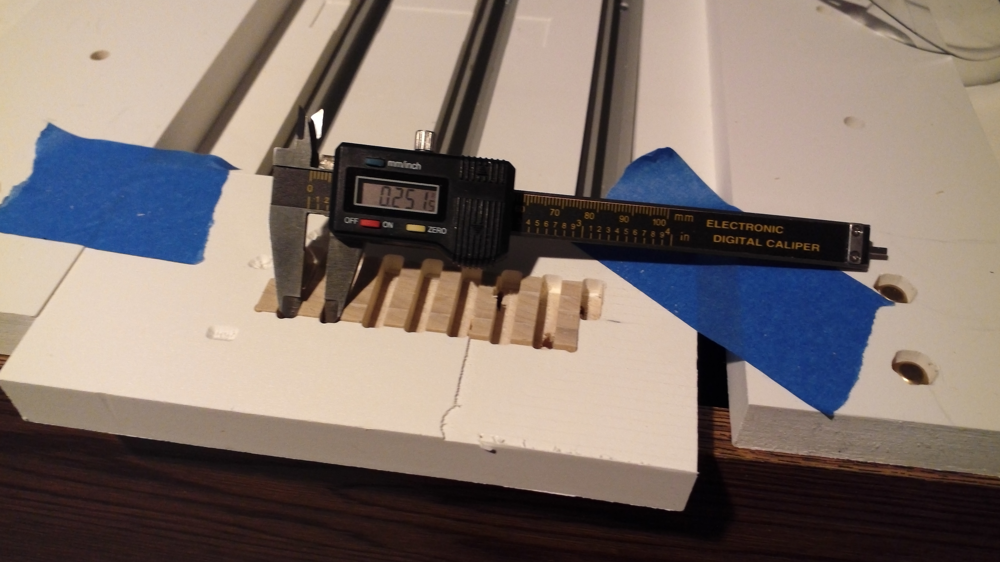
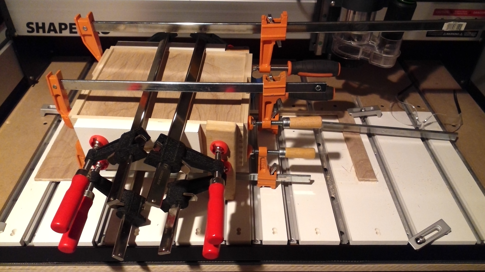
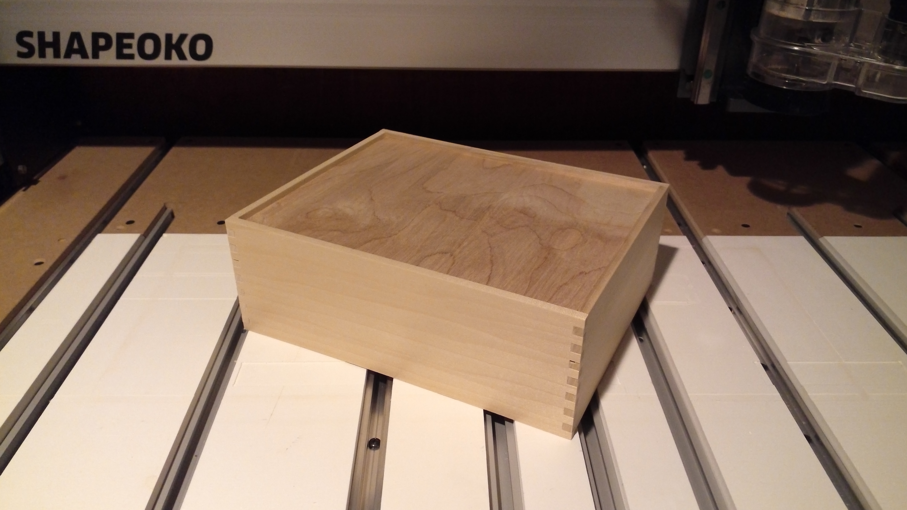
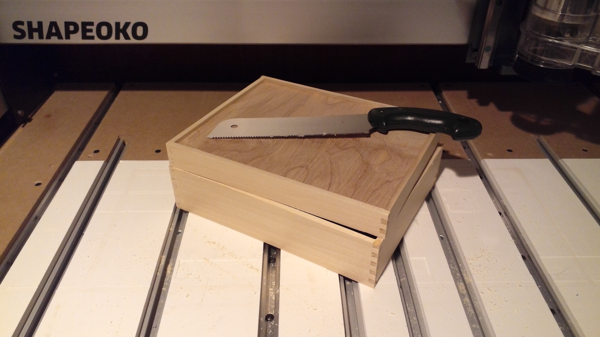
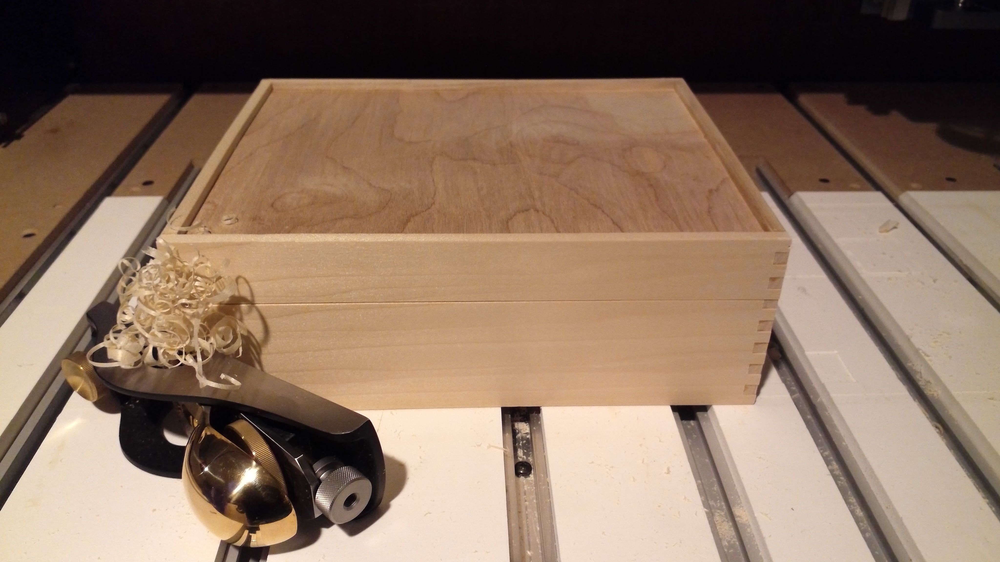
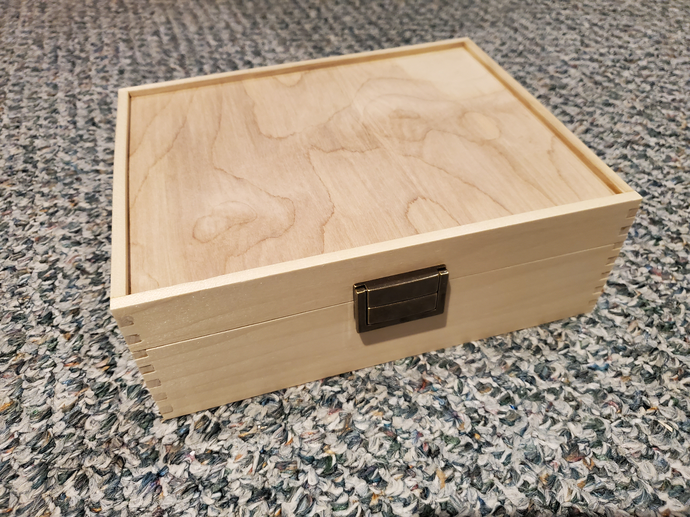

# Fingerjoints

Starting with the box design template from the previous chapter: [https://www.blockscad3d.com/community/projects/1012246](https://www.blockscad3d.com/community/projects/1012246) it is a simple matter of adding cuts for joinery along the corners of the box. Fingerjoints are notable since they can be implemented along all edges of a box and with a bit of a relief can be cut flat on the machine simplifying fixturing and making manufacture more efficient, but the traditional technique of fingerjoints at the box corner with the top and bottom in rabbeted grooves is simpler to calculate, and is discussed at: [https://community.carbide3d.com/t/cnc-finger-joint-box/8880](https://community.carbide3d.com/t/cnc-finger-joint-box/8880) and will be worked out in detail below.

Necessary additional variables are:

* Endmill Diameter
* Thickness of top/bottom grooves \(or possibly rabbets for reducing board thickness along edges to fit into grooves\)
* \(optional\) a number to influence how many fingers will be cut
* Some sort of option for the lid ― options include a sliding lid, a rabbet along the edge for the lid to fit onto, or a through cut after glue-up and a suitable hinge

If fingerjoints are cut in sheet goods with the boards flat, it is necessarily more complex

The interplay of the geometry of the board being flat and the cutter being round requires certain options and accommodations in the module for cutting the joints. It is necessary to specify:

* Endmill Diameter
* Whether the cut should be adjusted for endmill diameter
* Whether the cut should be relieved for endmill diameter
* If the cut should be adjusted at its beginning or end for the thickness of the material

Setting up a box design for this we duplicate the project from the previous chapter as: [https://www.blockscad3d.com/community/projects/1052045](https://www.blockscad3d.com/community/projects/1052045) and update it with the desired dimensions:

* 10 in wide
* 8 in deep
* 3.5 in high
* 0.25" thick stock
* 0.21653543" \(5.5mm\) thick top and bottom
* 0.375" part spacing

As OpenSCAD code, this has the file beginning as:

```text
//!OpenSCAD

Height = 3.5;
Width = 10;
Depth = 8;
Stock_Thickness = 0.25;
Top_Bottom_Thickness = 0.21653543;
Part_Spacing = 0.375;
//(millimeters or inches)
Units = 1; //[1:millimeters, 25.4:inches]
Preview_3D = true;
Joinery_Cut = false;
Generate_DXF = false;
Endmill_Diameter = 0.125;
```

With all of the variables set up, it is necessary to scale for units:

```text
h = Height * Units;
w = Width * Units;
d = Depth * Units;
st = Stock_Thickness * Units;
tbt = Top_Bottom_Thickness * Units;
ps = Part_Spacing * Units;
cd = Endmill_Diameter * Units;
fjcount = (ceil(Height / Stock_Thickness) / 2) * 2 + 1;
fjsize = h / fjcount;
```

as shown below:


Add code to cut grooves for the lid and for the fingerjoints themselves --- this will want a module for modeling the endmill:

```text
module em() {
  cylinder(r1=(cd / 2), r2=(cd / 2), h=(cd + st), center=false);
}
```

which is then used in a module which makes a cut as a pocket:

```text
module cut(cbx, cby, cex, cey, abx, aby, aex, aey, sd, ed) {
  translate([0, 0, (sd - ed)]){
    hull(){
      translate([cbx, cby, 0]){
        em();
      }
      translate([cex, cey, 0]){
        em();
      }
      translate([abx, aby, 0]){
        em();
      }
      translate([aex, aey, 0]){
        em();
      }
    }
  }
}
```


 A legacy of the prototype box file used is that there is a module for modeling a board:

```text
module board(ht, wd, dpth) {
  cube([wd, dpth, ht], center=false);
}
```

At some point in the future that may be used as a control point for modifying how the file is previewed or rendered.

That module is then used for additional modules for each sort of part needed. Quite simple for the top and bottom:

```text
module topbottom() {
  board(tbt, w - st, d - st);
}
```

But requiring various calculations for the grooves and fingerjoints for the sides:

```text
module sides() {
  difference() {
    board(st, h, d);

    cut(st / 2 + cd / 2, st / 2, st / 2 + cd / 2, d - st / 2, (st / 2 + tbt) - cd / 2, st / 2, (st / 2 + tbt) - cd / 2, d - st / 2, st, st / 2);
    translate([(h - st * 2), 0, 0]){
      cut(st / 2 + cd / 2, st / 2, st / 2 + cd / 2, d - st / 2, (st / 2 + tbt) - cd / 2, st / 2, (st / 2 + tbt) - cd / 2, d - st / 2, st, st / 2);
    }
    if (Generate_DXF == false) {
      union(){
        translate([0, (-cd), (-st)]){
          for (i = [1 : abs(2) : fjcount]) {
            translate([(i * fjsize), 0, 0]){
              cube([fjsize, (cd + st), (st * 3)], center=false);
            }
          }

        }
        translate([0, (d - st), (-st)]){
          for (i = [1 : abs(2) : fjcount]) {
            translate([(i * fjsize), 0, 0]){
              cube([fjsize, (cd + st), (st * 3)], center=false);
            }
          }

        }
      }
    }

  }
}
```

 and front/back:

```text
module frontback() {
  difference() {
    board(st, w, h);

    cut(st / 2, st / 2 + cd / 2, w - st / 2, st / 2 + cd / 2, st / 2, (st / 2 + tbt) - cd / 2, w - st / 2, (st / 2 + tbt) - cd / 2, st, st / 2);
    translate([0, (h - st * 2), 0]){
      cut(st / 2, st / 2 + cd / 2, w - st / 2, st / 2 + cd / 2, st / 2, (st / 2 + tbt) - cd / 2, w - st / 2, (st / 2 + tbt) - cd / 2, st, st / 2);
    }
    if (Generate_DXF == false) {
      union(){
        translate([(-cd), 0, (-st)]){
          for (i = [0 : abs(2) : fjcount - 1]) {
            translate([0, (i * fjsize), 0]){
              cube([(cd + st), fjsize, (st * 3)], center=false);
            }
          }

        }
        translate([(w - st), 0, (-st)]){
          for (i = [0 : abs(2) : fjcount - 1]) {
            translate([0, (i * fjsize), 0]){
              cube([(cd + st), fjsize, (st * 3)], center=false);
            }
          }

        }
      }
    }

  }
}
```

In particular note the halving and then doubling of the number of fingerjoints before adding 1 so as to ensure that an odd number is used for one set.

As well as laying out the parts for cutting:


The final aspect is cutting the joints ― the boards need to be offset from each other:


and cut in at least pairs \(cutting all four at once will halve the number of operations\):


See: [https://www.blockscad3d.com/community/projects/1053568](https://www.blockscad3d.com/community/projects/1053568)

Export to OpenSCAD from BlockSCAD and then customize the file in OpenSCAD to allow exporting SVGs:


The final code is using the checkboxes to control how the parts are rendered as discussed above:

```text
if (Preview_3D == false) {
    projection(cut = true)
    {
  union(){
    translate([0, (h + ps), -st*0.9]){
      sides();
    }
    translate([(h + ps), 0, -st*0.9]){
      frontback();
    }
    translate([((h + ps) + st / 2), ((h + ps) + st / 2), 0]){
      topbottom();
    }
    translate([(h + ps), ((h + ps) + (d + ps)), -st*0.9]){
      frontback();
    }
    translate([((h + ps) + (w + ps)), (h + ps), -st*0.9]){
      sides();
    }
  }
}} else {
  if (Joinery_Cut == false) {
    union(){
      translate([0, ps, (h + ps)]){
        rotate([0, 90, 0]){
          sides();
        }
      }
      translate([0, 0, 0]){
        mirror([0,1,0]){
          translate([ps, 0, ps]){
            rotate([90, 0, 0]){
              frontback();
            }
          }
        }
      }
      translate([(ps + st / 2), (ps + st / 2), (st / 2)]){
        topbottom();
      }
      translate([(ps + st / 2), (ps + st / 2), ((h + ps * 2) - st * 1.5)]){
        topbottom();
      }
      translate([((w + ps * 2) - 0), ps, (h + ps)]){
        rotate([0, 90, 0]){
          mirror([0,0,1]){
            sides();
          }
        }
      }
      translate([ps, (d + ps * 2), ps]){
        rotate([90, 0, 0]){
          frontback();
        }
      }
    }
  } else {
    if (Generate_DXF == true) {
        projection(){
      union(){
        cube([(cd / 2), (cd / 2), (cd / 2)], center=false);
        translate([fjsize, (-(cd / 2)), 0]){
          for (j = [0 : abs(2) : fjcount]) {
            translate([(j * fjsize), 0, 0]){
              cube([fjsize, ((st * 4 + ps * 3) + cd), (st * 2)], center=false);
            }
          }

        }
      }
    }} else {
      difference() {
        union(){
          translate([0, st, (st - d)]){
            rotate([90, 0, 0]){
              union(){
                sides();
                translate([0, 0, (-(st + ps))]){
                  sides();
                }
              }
            }
          }
          translate([fjsize, ((st + ps) * 2 + st), st]){
            rotate([90, 90, 0]){
              union(){
                frontback();
                translate([0, 0, (-(st + ps))]){
                  frontback();
                }
              }
            }
          }
        }

        translate([fjsize, (-(cd / 2)), 0]){
          for (j = [0 : abs(2) : fjcount]) {
            translate([(j * fjsize), 0, 0]){
              cube([fjsize, ((st * 4 + ps * 3) + cd), (st * 2)], center=false);
            }
          }

        }
      }
    }
  }
}

```

The OpenSCAD file is available at: [https://github.com/WillAdams/Design\_Into\_3D/blob/master/box/fingerjoint/vertical/Box\_%20Fingerjoint\_%20Vertical.scad](https://github.com/WillAdams/Design_Into_3D/blob/master/box/fingerjoint/vertical/Box_%20Fingerjoint_%20Vertical.scad)

Export each view and import into Carbide Create files:


Once imported, it will be helpful for the Cuts file to set the stock size to match the boards being used, and to draw in rectangles representing the boards --- this will help to make clear how they are to be positioned for cutting and how the toolpaths will interact. The 3D preview of the toolpaths shows the cuts which will be made which is accurate save for the excess stock shown at the upper left and lower right corners \(areas not encompassed by the orange highlighted boards in the image above\):


A desirable improvement is to trim the right-most geometry so that it only cuts the rearmost boards:



For the Parts file, it is only necessary at first to cut one side, and a single instance of the front/back part --- the parts need to be positioned in-line and separated by at least the endmill diameter plus 10%. The top/bottom will be measured for from the actual box after it is cut and dry fit. A further consideration here is the matter of accessing the interior of the box --- we will draw in a rectangle which may be cut with a narrow endmill \(or one may do the traditional cutting apart with a bandsaw or hand saw\):


Since the parts will be cut from an S4S board which is the correct size, it will only be necessary to machine the grooves for the top/bottom, the groove with tabs separating the lid from the base of the box \(import a copy of the fingerjoint cuts and rotate 90 degrees to allow for placement\), and pockets at the ends of each board to cut them to length. To eliminate the need for tabs and the attendant post-processing, work-holding will be two-stage:

* normal clamps outside the cutting area as well as a sacrificial caul clamp across the gap between the parts
* additional cauls added after cutting the grooves to secure the stock and ensure the parts do not move once cut free

To ensure the board is square to the machine the first operation will be to machine a pocket in which to register the board, then the board will be secured and the grooves cut, then the additional cauls put in place, and the last operation will be cutting the pockets which cut the part to length.


Verify the preview:


Then cut the parts:



Then mount them in a fixture such as: [https://cutrocket.com/p/5cb25f3380844/](https://cutrocket.com/p/5cb25f3380844/) and cut the joints







Then dry-fit to measure for cutting the top/bottom \(or just cut the top/bottom based on the initial CAD measurement\):


The cut the top and bottom and glue and clamp up:



Last cut apart, clean up edges, finish, and install hardware:









While it is possible to do traditional fingerjoints on a CNC, the tedium of multiple setups can be avoided on a CNC, which will be explored in the next chapter.

