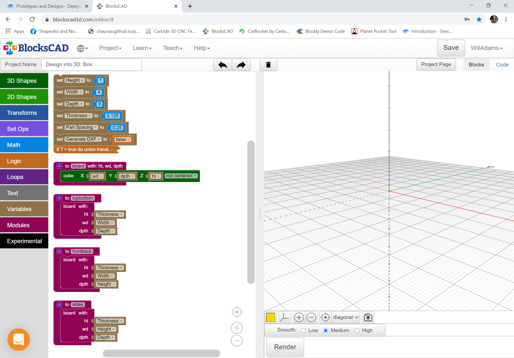
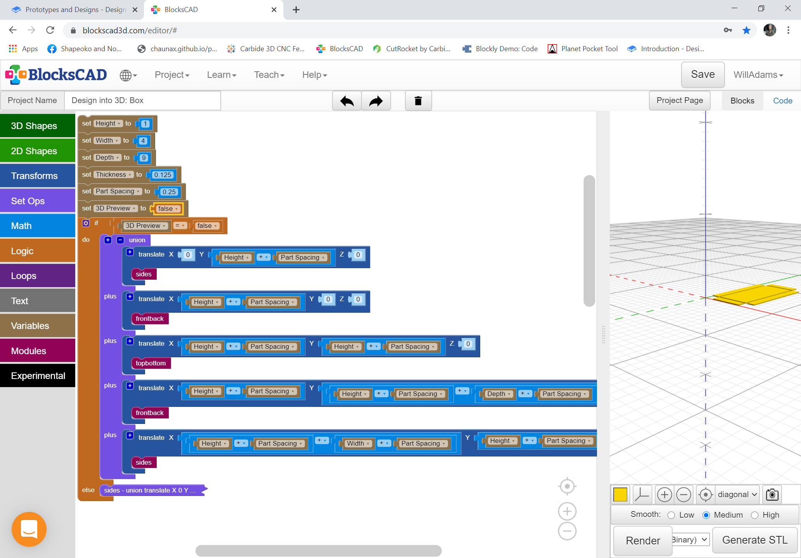
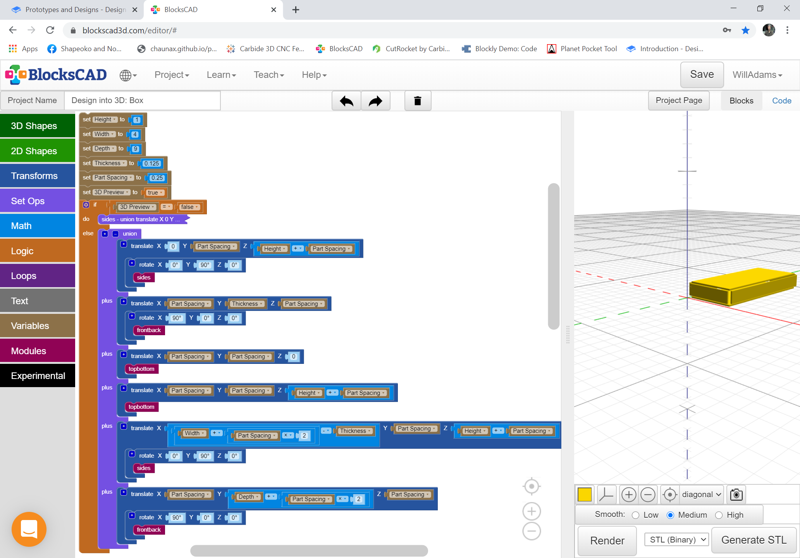

# Prototypes and Designs

As noted, projects are either boxes or platforms. Creating a template for a basic box design will allow the development of features and capabilities which may then be used for specific design implementations. Setup is straight-forward: variables for parameters and some modules for the parts:

Then it is simply a matter of setting up the logic for making either a DXF or a 3D preview and positioning \(and if need be rotating\) the parts for the appropriate view. For the flat \(DXF\) plan view:

Or for the 3D Preview:

This design template is available at: [https://www.blockscad3d.com/community/projects/965700](https://www.blockscad3d.com/community/projects/965700).

With the basic box design worked up the project may be duplicated for specific implementations and varying sorts of joinery techniques:

* fingerjoints ― there are two different approaches here, traditional and cut with the boards standing on end in a vertical fixture: [https://cutrocket.com/p/5cb536396c281/](https://cutrocket.com/p/5cb536396c281/) or a contemporary approach which typically uses sheet goods and are cut flat on the machine with the finger joints relieved in some way \(dogbones or some similar approach are easily done since they rely on the same tool used for the bulk of the cutting, _e.g._, [https://docs.carbide3d.com/tutorials/project-minibox/](https://docs.carbide3d.com/tutorials/project-minibox/) or [https://docs.carbide3d.com/tutorials/project-simplebox/](https://docs.carbide3d.com/tutorials/project-simplebox/)\)
* dovetails ― these also require that the boards be cut in a vertical fixture for traditional approaches
* rabbet joints ― these were shown in the previous chapter
* butt joints ― typically using nails or other hardware these are simply a matter of appropriately shortening the boards. Reinforcing with dowels or some other suitable technique may be easily done using a vertical fixture
* miter joints ― while modern adhesives make such joints feasible it is best to reinforce them in some way, full-blind dovetails being a traditional technique, but one which would be challenging to manage via CNC
* Knapp joints ― like to the dovetail joints which they replace these require a vertical fixture

  [https://github.com/WillAdams/Design\_Into\_3D/tree/master/box/knapp](https://github.com/WillAdams/Design_Into_3D/tree/master/box/knapp) 

There are 3 approaches for cutting joinery on a CNC:

* boards oriented at 90 degrees to each other using a vertical fixture such as: [https://cutrocket.com/p/5cb25f3380844/](https://cutrocket.com/p/5cb25f3380844/)
* boards arranged at various angles via fixtures ― one example was the commercial program AnyTail which used a 15 degree fixture so that a 30 degree V endmill could make a 90 degree cut 
* boards \(or sheet goods\) flat on the machine 

Since joints using vertical fixtures are simply a reprise of traditional work it is that last which will be focused on, beginning with the next chapter.

