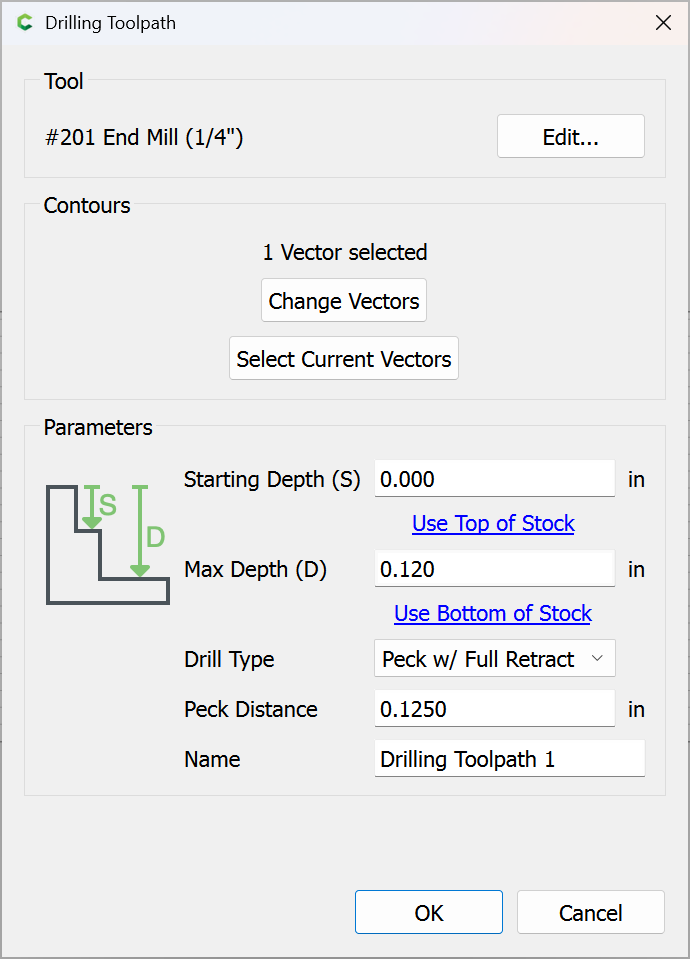

# Radiused Fingerjoints

There are many examples of cutting fingerjoints with dogbones to allow for the radius on an endmill, which works, but results in visible voids in the project. An alternative technique is to cut the fingerjoints and then use a cove radius endmill to round off the fingers as necessary allowing for a joint which does not have visible voids. For discussion see: [https://community.carbide3d.com/t/design-into-3d-boxes-magazine-storage/16238](https://community.carbide3d.com/t/design-into-3d-boxes-magazine-storage/16238)

Interestingly, it is possible to take a file intended for lasercutting and simply add some lines for the radiusing and then cut out the box \(if one is willing to forgo an accurate 3D preview of the cut\). Since this affords an expedient technique which allows approaching the project in a straight-forward fashion which can be built on to understand the concepts in question, this will be shown first.

## Generate the Design

Start with a suitable generator ― we will use:



This project will be a 3" x 3" x 3" open box:

Download the box plans as an SVG:

Import them into Carbide Create and arrange for cutting:

_If_ the MakerCase tool allowed one to set the stock thickness \(0.25"\) which will be used. 

### Making the Bottom

Reworking the files is a useful review of how the box is constructed. Starting with the bottom, draw a box the size of the base:

Inset by the thickness of the stock which will be used \(plus desired glueline if need be\):

The design will not be precisely recreated, but the basic concept will be followed. The bottom is symmetrical which makes later design easier, and the fingerjoints are inset somewhat ― we will use half the stock thickness, so adjust the grid spacing accordingly and draw in a rectangle which represents this length centered at one edge of the box:

This needs to be divided into fifths \(two fingers and three gaps\):

And then duplicated and dragged into registration with the desired positioning:

Then set the rectangles at the finger locations to be the height of the box and drag them into position:

Since the box is square, the two fingers and the outer rectangle may be duplicated, rotated 90 degrees, and dragged into registration with the part:

Select the narrow rectangles for the fingers and the inset of the bottom:

And then Boolean union:

### Making the Sides

For the sides we can recycle the remaining rectangles by setting them to the same thickness and aligning them with the base and recreating the inset and Boolean unioning the parts:

## Model the Endmill

Unfortunately, Carbide Create doesn't support cove radius endmill geometry, so it will be necessary to work out where to place lines so as to cut the desired radius ― draw up a profile of your endmill to work this out ― a cove radius should have a tip diameter, a diameter at the top which determines how widely it will cut, a total cutting height, and of course the radius itself:

Then draw up the side view to help determine where the cut should be made and draw in the tooling showing where the cuts should \(and should not\) be made:

